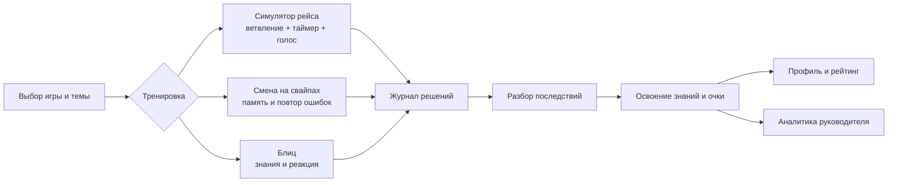

# «Турбо-Бригада»

**Геймифицированный тренажёр для проводников высокоскоростной магистрали.**

Проводник ВСМ принимает решения за секунды: успокаивает пассажира, действует при медицинском инциденте, проверяет документы и соблюдает требования безопасности. «Турбо-Бригада» превращает такие ситуации в безопасную тренировку: проводник проходит ветвящийся рейс, выбирает действие под таймером, видит последствия и закрепляет знания в коротких игровых режимах.

Проект создан для трека [«Геймификация для ВСМ»](docs/Геймификация%20для%20ВСМ.md).

Онлайн-демо: [http://176.108.245.180](http://176.108.245.180)

Архитектура: [docs/architecture.md](docs/architecture.md)

User flow: [user-flow.md](docs/user-flow.md)

## Возможности продукта

| Раздел | Возможности |
| --- | --- |
| Симулятор рейса | Ветвящиеся События, условия, таймеры, шкалы «Лояльность пассажира» и «Рейтинг безопасности», разные Исходы |
| Игры для закрепления знаний | «Смена на свайпах» с повтором ошибок и режимом Woodpecker; «Блиц» с вопросами на время |
| Обратная связь | Разбор решений с изменениями шкал, очками, комментариями и источниками правил |
| Профиль и рейтинг | Очки знаний и компетенций, Звание, рейтинги проводников и бригад |
| Аналитика | Тепловая карта «Тема × Компетенция», проблемные вопросы и показатели голосовых Шагов |
| Рабочее место методиста | Банк вопросов, Источники, черновики, JSON-редактор Событий и публикация версий |
| Голосовой режим | Распознавание речи, структурированная оценка Laya и потоковый ответ пассажира |
| API | Документированный ASP.NET Core API с OpenAPI/Swagger и Bearer-аутентификацией |

## Пользовательский сценарий

1. Открыть [онлайн-демо](http://176.108.245.180) или локальный стенд по инструкции ниже.
2. На экране входа выбрать **«Проводник-отличник»** (`conductor-star`).
3. Открыть **«Симулятор рейса»** и пройти рейс:
   - выбрать класс обслуживания и проактивное действие;
   - принять решение в ситуации №6 «Пассажир с признаками алкогольного опьянения» или №33 «Два пассажира на одно место»;
   - увидеть таймер, изменение двух шкал и влияние решения на следующий шаг;
   - завершить рейс и открыть подробный разбор.
4. В **«Смене на свайпах»** пройти тренировку памяти, режим Woodpecker, повтор ошибок и пояснение с источником.
5. В **«Блице»** пройти вопросы с одним/несколькими ответами и сборкой последовательности на время.
6. Открыть **«Профиль»** и **«Рейтинг»**: очки начисляются по освоенным знаниям, рейтинг доступен на уровне бригады, депо и компании.
7. Выйти и выбрать **«Руководитель-методист»** (`manager-methodologist`):
   - открыть аналитику «Тема × Компетенция»;
   - в CMS вставить текст Источника и получить черновики вопросов;
   - открыть редактор События, изменить переход или дельту шкалы, запустить валидатор и опубликовать новую версию.

Если в `.env` указаны ключи голосовых провайдеров, в Событиях №6 и №33 доступен голосовой Шаг: речь → распознавание → структурная оценка Laya → ответ пассажира от LLM.

## Какую проблему решаем

Лекции и тесты проверяют знание правил, но почти не тренируют поведение в стрессе и дефиците времени. Реальные инциденты нельзя безопасно воспроизводить на борту, а оценка soft skills часто остаётся субъективной.

«Турбо-Бригада» даёт проводнику повторяемую тренировку без риска для пассажиров и руководителю — наблюдаемую картину компетенций:

- решения меняют состояние рейса, а не только отмечаются как «верно/неверно»;
- безопасность и лояльность считаются параллельно, поэтому у решения может быть разная цена по двум шкалам;
- после прохождения пользователь видит, что именно повлияло на исход и как улучшить действие;
- контент можно обновлять методистом без переписывания движка.

## Игровой цикл



### Симулятор рейса

Рейс состоит из заступа, проактивного выбора, двух Событий и прибытия или Срыва. Каждое Событие — это опубликованный граф шагов. Вариант может:

- изменить шкалы лояльности и безопасности;
- начислить или снять очки знания;
- установить Флаг, который повлияет на последующее Событие;
- вести в другую ветку по условию;
- закончить Событие успешным или неуспешным Исходом.

Таймер принадлежит серверу. Поздний ответ или явный таймаут идёт по ветке `timeout`; повторный ответ на уже пройденный шаг отклоняется.

### Смена на свайпах и Блиц

«Смена на свайпах» тренирует память на колоде вопросов. В спокойном режиме ошибки возвращаются в текущую Смену, а режим Woodpecker ускоряет циклы **10 → 7 → 5 секунд**. «Блиц» проверяет знания на время; банк вопросов общий для Свайпов, Блица и CMS.

### Очки и обратная связь

Публикуемый вопрос или вариант События имеет стоимость знания. Последняя попытка определяет освоение: правильный ответ начисляет стоимость, последующая ошибка снимает её. В журнале сохраняется `knowledgeDelta`, поэтому профиль, Разбор и лидерборд строятся из истории действий, а не из декоративного счётчика.

## Быстрый запуск

### Требования

- Docker Engine;
- Docker Compose v2;
- доступ к PostgreSQL из `.env`.

В текущем демо Compose поднимает API и фронтенд. PostgreSQL — общий сервер команды; локальный контейнер базы намеренно не создаётся.

### Запуск через Docker

1. Скопировать шаблон конфигурации:

   ```bash
   cp .env.example .env
   ```

2. Заполнить в `.env` `POSTGRES_USER` и `POSTGRES_PASSWORD` из материалов сдачи. Задать случайный `Jwt__Key` длиной не менее 32 символов. Ключи `POLZA_API_KEY` и `LAYA_API_TOKEN` нужны только для голосового конвейера и ИИ-генерации.

3. Запустить стенд:

   ```bash
   docker compose up --build
   ```

   При старте API применяет ожидающие миграции и добавляет отсутствующий стартовый контент и демо-аккаунты. Повторный запуск не перезаписывает опубликованные изменения методиста.

4. Открыть:

   - приложение: [http://localhost:3000](http://localhost:3000);
   - Swagger: [http://localhost:5017/swagger](http://localhost:5017/swagger);
   - OpenAPI JSON: [http://localhost:5017/openapi/v1.json](http://localhost:5017/openapi/v1.json).

Остановить стенд: `Ctrl+C`. После изменения кода повторить `docker compose up --build`.

> **Безопасность конфигурации:** `.env` содержит доступ к общей базе и секреты провайдеров. Его не нужно коммитить или публиковать. Для отдельного локального контура потребуется PostgreSQL и собственная строка подключения; это не часть текущего Compose-профиля.

## Демо-аккаунты и роли

На экране входа кнопки **«Войти как…»** используют `POST /api/auth/demo-login` и не требуют пароля.

| Кнопка | Логин | Роль | Доступные разделы |
| --- | --- | --- | --- |
| Проводник-отличник | `conductor-star` | Проводник | Рейс, Свайпы, Блиц, профиль, рейтинг |
| Проводник-новичок | `conductor-novice` | Проводник | Стартовый профиль и прогресс |
| Руководитель-методист | `manager-methodologist` | Руководитель + Методист | Аналитика, CMS и публикация контента |

Пароли `DEMO_*_PASSWORD` нужны только сидеру и обычному API-входу. Для демо-кнопок они не вводятся. Демо-вход можно отключить настройкой `DemoAccounts__LoginEnabled=false`.

## Голосовой конвейер

Голосовой Шаг не принимает решение через свободный текстовый ответ. Сервер выполняет отдельные этапы:

1. аудио отправляется на STT GigaAM-v3;
2. транскрипт и структурированные критерии отправляются в Laya;
3. Laya выбирает вариант графа и возвращает оценку вежливости, этапы ролевой модели и вероятность нарушения безопасности;
4. LLM формулирует реплику пассажира потоково;
5. выбор варианта сохраняется только после успешного завершения ответа.

Это позволяет обновить шкалы по решению Laya независимо от задержки генерации текста. Неуверенный ответ провайдера получает `422` и не меняет состояние Шага; аудио не сохраняется.

Внешние ключи задаются в `.env`:

```dotenv
POLZA_API_KEY=...
LAYA_API_TOKEN=...
```

Без ключей кнопочные ветки, Свайпы, Блиц, профиль, рейтинг и CMS работают; голосовой Шаг и генерация через LLM недоступны.

## API

Полная интерактивная схема доступна в Swagger после запуска. Основные группы эндпоинтов:

| Группа | Назначение |
| --- | --- |
| `/api/auth/*` | регистрация, обычный вход, демо-вход и текущий пользователь |
| `/api/trips/*` | старт рейса, состояние, выбор варианта, таймаут, proactive и голосовой Шаг |
| `/api/swipe-shifts/*` | Смена, ответы, таймауты, циклы и работа над ошибками |
| `/api/profile`, `/api/leaderboard` | профиль, Очки, Звание и рейтинги |
| `/api/analytics/*` | аналитика руководителя и задержки голосового конвейера |
| `/api/cms/sources/*` | Источники и генерация черновиков вопросов/Событий |
| `/api/cms/questions/*`, `/api/cms/events/*` | банк вопросов, JSON-графы и публикация версий |

Защищённые методы используют `Authorization: Bearer <JWT>`. В Swagger нажмите **Authorize** и вставьте токен без лишнего текста, если UI просит только значение токена.

## Ограничения прототипа и план развития

Ограничения текущего MVP:

- STT, Laya и LLM работают через внешние сервисы и требуют интернет и ключи;
- Laya запускается во внешнем контуре, поэтому целевая задержка GPU не гарантируется на демонстрационном CPU-контуре;
- уведомления, достижения, челленджи и сезонные механики пока представлены экранным MVP/заготовками, а не полным фоновым сервисом;
- нет двусторонней интеграции с HR/LMS, SSO и xAPI;
- в демо используются синтетические сотрудники и предзагруженный контент.

После хакатона:

1. развернуть STT, Laya и LLM в защищённом контуре Московского транспорта;
2. добавить push/e-mail уведомления, полноценные Ачивки, Челленджи и сезоны;
3. сделать визуальный редактор графов и загрузку PDF/DOCX/CSV/XLSX с очисткой ПДн;
4. подключить HR/LMS, SSO и экспорт xAPI;
5. расширить библиотеку Событий и аналитику динамики компетенций.

## Данные и безопасность

- В репозитории нет паролей, токенов и реальных персональных данных.
- Демо-аккаунты, организации, рейтинг и контент синтетические.
- Секреты читаются из `.env`; файл исключён из Git.
- Доступ к API ограничен ролями, а ошибки движка возвращают предсказуемый код `reason` без изменения состояния.
- Для схемы базы используются EF Core migrations, ручная правка схемы не требуется.

## Лицензия

Проект подготовлен для хакатона Московского транспорта. Лицензия и условия дальнейшего использования определяются организаторами и правообладателем репозитория.
