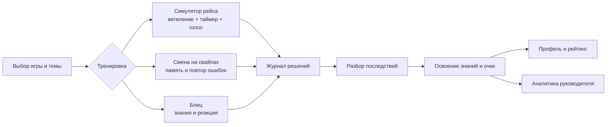

# «Турбо-Бригада»

**Геймифицированный тренажёр для проводников высокоскоростной магистрали.**

Онлайн-демо: [http://176.108.245.180](http://176.108.245.180)

Архитектура: [docs/architecture.md](docs/architecture.md)

User flow: [user-flow.md](docs/user-flow.md)

## Ключевые технические особенности

**Голосовая тренировка** — проводник отвечает на вопросы голосом, аудио переводится в текст, ответ анализируется.

**laya** — [открытый ИИ-движок](https://github.com/NandhaKishorM/laya) принятия решений. Она сопоставляет свободный ответ проводника с заранее описанными действиями и оценивает, насколько вежливо и безопасно он общается с пассажиром. Благодаря этому проводник может отвечать своими словами, а игра сохраняет понятные развилки и объяснимые последствия.

## Краткий user-flow

1. Открыть [онлайн-демо](http://176.108.245.180) или запустить локальный стенд (инструкция ниже)
2. На экране входа выбрать **«Проводник-отличник»** (`conductor-star`).
3. Открыть **«Симулятор рейса»** и пройти рейс:
   - выбрать класс обслуживания и проактивное действие;
   - принять решение в ситуации №6 «Пассажир с признаками алкогольного опьянения» или №33 «Два пассажира на одно место»;
   - увидеть таймер, изменение двух шкал и влияние решения на следующий шаг;
   - завершить рейс и открыть подробный разбор.
4. В **«Смене на свайпах»** пройти тренировку памяти, режим Woodpecker, повтор ошибок и пояснение с источником.
5. В **«Блице»** пройти вопросы с одним/несколькими ответами и сборкой последовательности на время.
6. Открыть **«Профиль»** и **«Рейтинг»**: очки начисляются по освоенным знаниям, рейтинг доступен на уровне бригады, депо и компании.
7. Выйти и выбрать **«Руководитель-методист»** (`manager-methodologist`):
   - открыть аналитику «Тема × Компетенция»;
   - в CMS вставить текст Источника и получить черновики вопросов;
   - открыть редактор События, изменить переход или дельту шкалы, запустить валидатор и опубликовать новую версию.



## Локальный запуск проекта

1. Файл `.env` из материалов сдачи положить в корень проекта

2. Запустить стенд:

   ```bash
   docker compose up --build
   ```

   При старте API применяет ожидающие миграции и добавляет отсутствующий стартовый контент и демо-аккаунты. Повторный запуск не перезаписывает опубликованные изменения методиста.

3. Открыть:

   - UI: [http://localhost:3000](http://localhost:3000);
   - Swagger: [http://localhost:5017/swagger](http://localhost:5017/swagger);

Для работы в закрытом контуре также потребуется развернуть:
- laya
- PostgreSQL
- OpenAI-совместимый роутер и желаемые модели

## Как работает Laya в голосовом сценарии

На голосовом шаге проводник отвечает пассажиру своими словами. Laya решает задачу, которую нельзя надёжно свести к сравнению с одной эталонной фразой: распознать смысл ответа, выбрать подходящий вариант сценария и оценить качество общения. В одном запросе она возвращает выбор ветки с показателем уверенности, оценку вежливости, признаки этапов ролевой модели («признать ситуацию → обозначить правило → предложить решение → заверить») и вероятность нарушения требований безопасности.

Это даёт несколько практических преимуществ:

- проводнику не нужно заучивать точную формулировку — он тренирует живой разговор;
- выбор Laya ограничен вариантами текущего шага, а изменения шкал и переходы задаёт сценарий, поэтому последствия можно объяснить в Разборе;
- генерация реплики пассажира отделена от оценки: LLM поддерживает диалог, но не назначает баллы и не выбирает исход;
- при низкой уверенности ответ не засчитывается автоматически: пассажир просит уточнить сказанное, и проводник отвечает повторно.

Последовательность обработки:

1. аудио отправляется на STT GigaAM-v3;
2. транскрипт и структурированные критерии отправляются в Laya;
3. Laya возвращает структурированную оценку и вариант из текущего графа;
4. LLM потоково формулирует следующую реплику пассажира;
5. после успешного ответа пассажира выбранный вариант применяется к рейсу.

При ошибке сервиса или недостаточной уверенности рейс остаётся на том же шаге. Аудио не сохраняется.

## API

Основные группы эндпоинтов:

| Группа | Назначение |
| --- | --- |
| `/api/auth/*` | регистрация, обычный вход, демо-вход и текущий пользователь |
| `/api/trips/*` | старт рейса, состояние, выбор варианта, таймаут, proactive и голосовой Шаг |
| `/api/swipe-shifts/*` | Смена, ответы, таймауты, циклы и работа над ошибками |
| `/api/profile`, `/api/leaderboard` | профиль, Очки, Звание и рейтинги |
| `/api/analytics/*` | аналитика руководителя и задержки голосового конвейера |
| `/api/cms/sources/*` | Источники и генерация черновиков вопросов/Событий |
| `/api/cms/questions/*`, `/api/cms/events/*` | банк вопросов, JSON-графы и публикация версий |

Защищённые методы используют `Authorization: Bearer <JWT>`