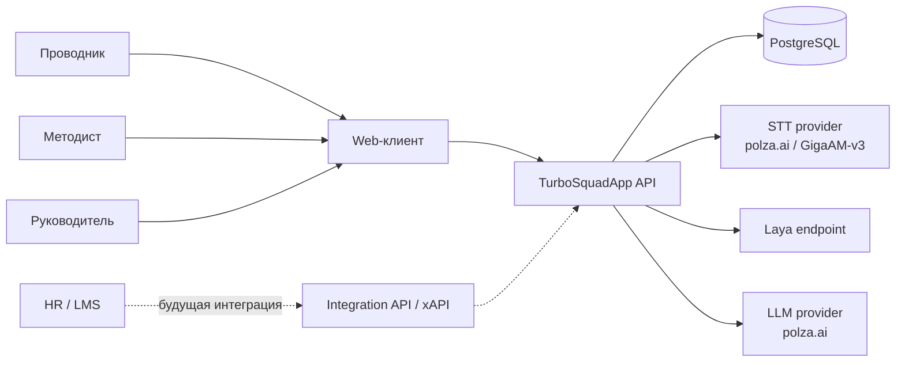
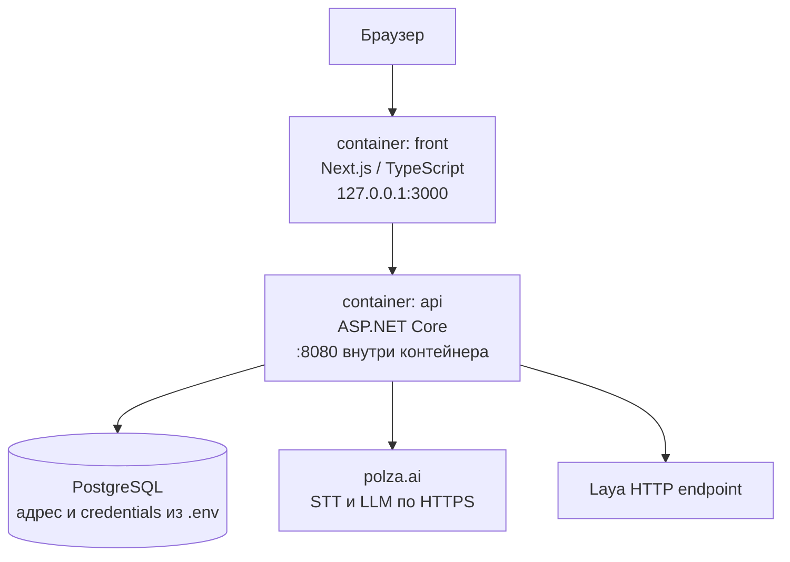
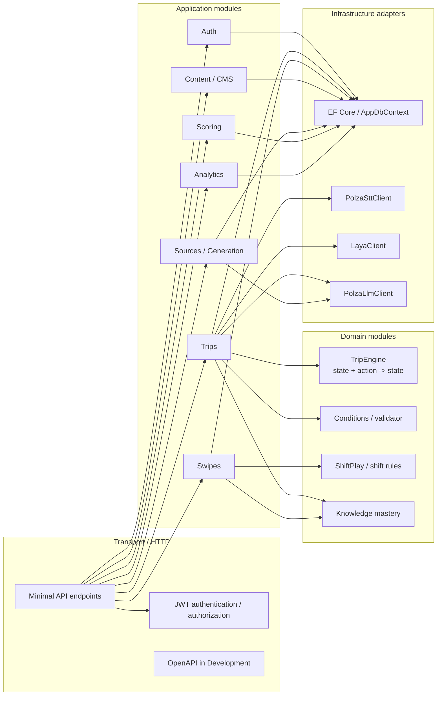
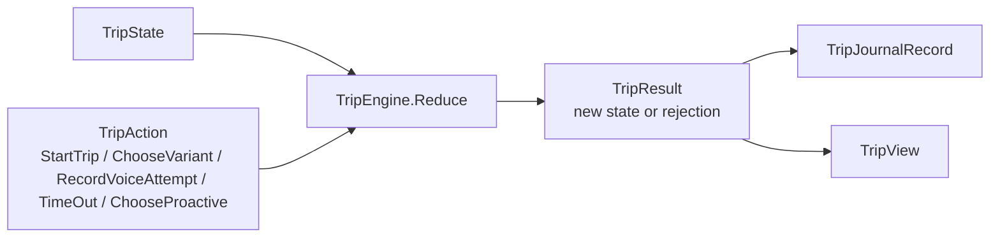
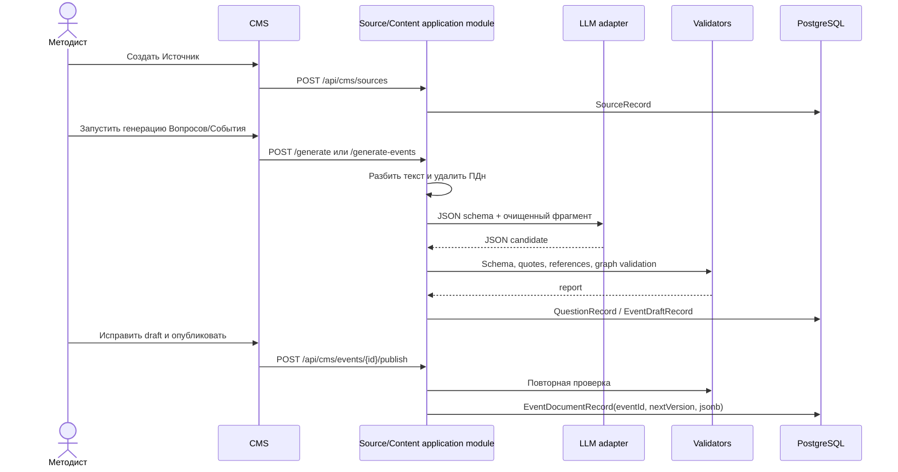
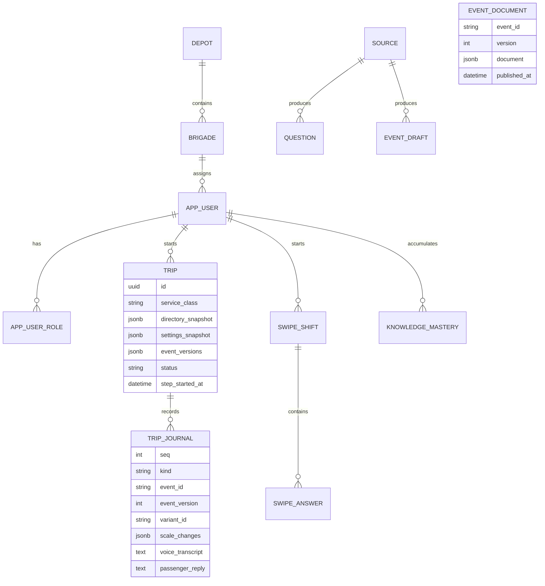

# Техническая архитектура TurboSquadApp

## 0. Статус документа

| Поле | Значение |
|---|---|
| Назначение | Базовая архитектура MVP и правила дальнейшего развития |
| Область | Код в `back/`, `front/` и deployment-конфигурация в `docker-compose.yml` |
| Нормативные источники | `docs/prd-turbo-brigada-v7.md`, `CONTEXT.md`, ADR-0001—ADR-0005 |
| Состояние | Baseline: согласовано с текущей реализацией; целевые расширения помечены отдельно |
| Дата проверки | 27.09.2026 |

Документ фиксирует технические решения, границы модулей, контракты между ними и эксплуатационные ограничения. Он не заменяет PRD и ADR: PRD определяет продуктовые требования, ADR — отдельные спорные решения, этот документ связывает их с работающей реализацией.

## 1. Контекст и границы системы

TurboSquadApp — тренажёр для проводников ВСМ. Система предоставляет три пользовательских контура:

1. **Проводник** проходит Симулятор рейса и Смену на свайпах, получает Разбор и видит профиль/рейтинг.
2. **Методист** управляет Источниками, Вопросами и версионируемыми Событиями, включая генерацию черновиков.
3. **Руководитель** получает профильные и голосовые метрики по доступным данным.

В текущей поставке реализованы авторизация, Симулятор рейса, Смена на свайпах, CMS Источников/Вопросов/Событий, генерация контента, скоринг знаний, профиль, рейтинг и голосовая аналитика. Integration API/xAPI, Блиц, сезоны, уведомления и двусторонняя интеграция с HR/LMS остаются целевыми расширениями PRD.

### 1.1. Внешний контекст



Внешние ИИ-провайдеры являются адаптерами инфраструктурного уровня. Доменная логика не зависит от формата их ответов и не делегирует им право изменять состояние Рейса.

## 2. Архитектурные драйверы

| Драйвер | Архитектурное следствие |
|---|---|
| Объяснимое ветвление | Собственный серверный `TripEngine`; граф События хранится как валидируемый JSON-документ |
| Защита от обхода таймера и правил | Сервер проверяет JWT, текущую позицию, Условия, таймер и допустимость Варианта |
| Историческая воспроизводимость | Версии Событий и снимки справочников фиксируются в `TripRecord`; состояние восстанавливается проигрыванием журнала |
| Быстрая правка контента | CMS работает с черновиком и публикует новую версию; движок не меняется при изменении графа |
| Замена ИИ-провайдера | Интерфейсы `ISttClient`, `ILayaClient`, `ILlmClient`; конкретные `Polza*Client` регистрируются через DI |
| Тестируемость | `TripEngine` — чистый модуль без БД, HTTP и часов; внешние провайдеры изолированы адаптерами |
| Объяснимый скоринг | `KnowledgeScoringService` хранит освоение единиц знания, а не только накопительную сумму |
| Минимальная операционная сложность | ASP.NET Core modular monolith и одна база PostgreSQL вместо распределённой транзакционной системы |

## 3. Контейнеры и deployment



`docker-compose.yml` поднимает только `front` и `api`; PostgreSQL подключается как внешняя общая БД. API при включённом `Database:MigrateOnStartup` применяет зафиксированные EF Core migrations, затем выполняет seed справочников и демо-контента. Laya в текущем compose не является локальным контейнером: адрес задаётся конфигурацией `Voice:LayaEndpoint`.

Frontend не является источником доменного состояния. Он хранит access token, вызывает JSON/multipart endpoints, управляет записью аудио и отображает `TripView`/`ShiftStateView`. При голосовом ответе клиент читает SSE-поток токенов и повторно синхронизирует состояние по итоговому `TripView`.

## 4. Внутренняя структура API



### 4.1. Границы модулей и seams

В терминах design vocabulary каждый модуль должен иметь узкий interface и скрывать реализацию за seam. Сейчас эти seams представлены сервисами и интерфейсами в одном ASP.NET Core процессе; физическое разделение на сервисы не требуется.

| Модуль | Ответственность | Interface / seam | Запрещённая ответственность |
|---|---|---|---|
| `Auth` | регистрация, login, demo-login, формирование и проверка identity | JWT middleware, `LoginService`, `RegistrationService` | игровой скоринг и загрузка контента |
| `Trips` | orchestration запроса, загрузка контента, серверный timer, replay, журнал, HTTP view | `TripService`; `/api/trips/*` | самостоятельное вычисление ветвления вне `TripEngine` |
| `TripEngine` | чистое применение `TripAction` к `TripState`: Условия, Шкалы, Флаги, переходы, Исходы, Срыв | `TripEngine.Reduce` | БД, HTTP, системные часы, вызовы ИИ |
| `Voice` | STT и классификация ответа, оценка Коммуникации, генерация пассажирской реплики | `IVoicePipeline`, `ISttClient`, `ILayaClient`, `ILlmClient` | выбор произвольной ветки или изменение доменных правил |
| `Swipes` | колода, циклы Woodpecker, серверное время ответа, повтор ошибок | `SwipeShiftService`, `ShiftPlay` | исполнение графа События |
| `Content/CMS` | Источники, Вопросы, События, draft/publish, версии | `SourceService`, `QuestionBankService`, `EventCmsService` | публикация непроверенного документа |
| `Generation` | chunking Источника, PII scrubber для CMS, вызов LLM, schema/quote validation | `QuestionGenerationService`, `EventGenerationService` | непосредственное изменение состояния Рейса |
| `Scoring` | mastery по Единицам знания, очки, профиль, лидерборд | `KnowledgeScoringService` и read endpoints | принятие кадрового решения |
| `Analytics` | агрегирование voice latency/quality из журнала | `VoiceAnalyticsService` | изменение игровых результатов |

### 4.2. HTTP composition root

`back/Program.cs` является composition root:

- регистрирует `AppDbContext` с Npgsql и snake_case naming;
- регистрирует доменные/application services с scoped lifetime;
- регистрирует внешние HTTP adapters через `AddHttpClient`;
- включает JWT authentication, authorization, CORS и OpenAPI;
- подключает endpoint groups через `MapTripEndpoints`, `MapSwipeEndpoints`, `MapEventCmsEndpoints` и остальные модули.

Endpoint-файлы являются transport-слоем: они извлекают identity и request DTO, затем передают управление сервису. Валидация переходов, таймера и состояния не должна дублироваться во frontend.

### 4.3. Внешние интерфейсы API

| Route group | Транспорт | Авторизация | Семантика |
|---|---|---|---|
| `/api/auth/*` | JSON | `register`, `login`, `demo-login` — anonymous; `/me` — Bearer | выдача stateless identity и чтение текущего пользователя |
| `/api/trips/*` | JSON, multipart, SSE | Bearer | запуск Рейса, действия движка, голосовая попытка и Разбор |
| `/api/swipe-shifts/*` | JSON | Bearer + `conductor` | колода, ответ, таймаут, цикл и Разбор Смены |
| `/api/cms/sources/*` | JSON | Bearer + `methodologist` | Источники и генерация черновиков |
| `/api/cms/questions/*` | JSON | Bearer + `methodologist` | банк Вопросов и публикация |
| `/api/cms/events/*` | JSON | Bearer + `methodologist` | draft, валидация и публикация версий Событий |
| `/api/events/validate` | JSON | anonymous | локальная проверка JSON-документа События без публикации |
| `/api/profile`, `/api/leaderboard` | JSON | Bearer + `conductor` | read-модель профиля и рейтинга |
| `/api/analytics/voice` | JSON | Bearer + `manager` | агрегаты latency и качества голосовых попыток |

HTTP-контракт не содержит доменных объектов EF Core напрямую: endpoint возвращает отдельные view/DTO (`TripView`, `ShiftStateView`, `QuestionView` и т. д.). Для отказов действий используется единый `ProblemDetails` с `reason`; успешные изменения состояния возвращают актуальное представление, пригодное для resync клиента.

## 5. Домен Симулятора рейса

### 5.1. Модель исполнения



`TripEngine` — deep module: callers знают только набор действий и результат, а правила применения последствий скрыты внутри реализации. Для каждого действия движок:

1. проверяет, что Рейс и текущая фаза допускают действие;
2. вычисляет доступные Варианты и Условия;
3. применяет дельты Шкал с ограничением диапазона;
4. устанавливает Флаги;
5. обрабатывает `CriticalError` и пороги обязательных Шкал;
6. выбирает первый переход с выполненными Условиями;
7. application layer фиксирует результат как нормализованную запись журнала.

Условия являются структурированными данными (`scale`, `flag`, `class`) и объединяются по «И». Переходы упорядочены; первый подходящий переход выигрывает. Правила и полный перечень проверок закреплены в ADR-0001 и ADR-0002.

### 5.2. Snapshot + replay

При старте `TripService.StartAsync`:

1. загружает актуальные справочники, настройки и последние опубликованные версии Событий;
2. применяет `StartTrip` через `TripEngine`;
3. создаёт `TripRecord` со снимками `Directory`, `Settings`, `EventVersions`;
4. записывает начальное состояние и сохраняет транзакцию.

При следующем запросе `TripService.LoadAsync` читает эти снимки, загружает зафиксированные версии Событий и проигрывает `TripJournalRecord` в порядке `Seq`. Отдельного mutable snapshot доменного состояния нет. Это обеспечивает:

- воспроизводимый Разбор;
- независимость старого Рейса от публикаций CMS;
- возможность строить аналитику по фактическим решениям;
- единый путь восстановления после перезагрузки клиента.

### 5.3. Серверное время и stale actions

`TripRecord.StepStartedAt` — источник истины для таймера. Перед применением действия сервис проверяет:

- принадлежность Рейса пользователю;
- совпадение `eventId/stepId` с текущей позицией;
- допустимость типа ответа для текущего Шага;
- истечение таймера с сетевым допуском;
- отсутствие незавершённой голосовой попытки.

Ошибки возвращаются как `ProblemDetails` с машинным кодом причины (`StaleStep`, `HiddenVariant`, `TimerNotExpired` и т. п.).

## 6. Голосовой контур

Голосовой контур разделён на две фазы:

1. `IVoicePipeline.ProcessAsync` принимает audio stream, вызывает STT и Laya, проверяет confidence и принадлежность результата списку Вариантов.
2. `TripService.StreamVoiceReplyAsync` по принятой попытке формирует детерминированный `PassengerReplyContext`, вызывает потоковую LLM и после успешного завершения коммитит ответ и переход.

```mermaid
sequenceDiagram
    autonumber
    actor C as Проводник
    participant F as Next.js
    participant T as TripService
    participant D as PostgreSQL
    participant E as TripEngine
    participant S as ISttClient / STT
    participant L as ILayaClient / Laya
    participant G as ILlmClient / LLM

    C->>F: Записать голосовой ответ
    F->>T: POST /api/trips/{id}/voice\n(audio, eventId, stepId, attemptId)
    T->>D: Load TripRecord + replay journal
    T->>T: JWT, текущий voice-Шаг, размер и timer
    T->>S: TranscribeAsync(audio)
    S-->>T: transcript + latency
    T->>L: DecideAsync(situation, brief, transcript, allowed variants)
    L-->>T: choice + confidence + assessment
    T->>E: RecordVoiceAttempt
    E-->>T: VoiceAttempt или rejection

    alt STT/Laya error или confidence ниже порога
        T->>D: Сохранить не применённую попытку
        T-->>F: 422; состояние Шага не изменилось
    else deadline exceeded
        T->>E: TimeOut
        E-->>T: timeout branch
        T->>D: Сохранить timeout и последствия
        T-->>F: TripView с новой позицией
    else choice принята
        T->>E: Preview ChooseVariant(choice)
        E-->>T: preview state
        T->>D: Сохранить VoiceAttempt(pending)
        T-->>F: TripView с pending attempt
        F->>T: GET /api/trips/{id}/voice/{attemptId}/reply
        T->>D: Atomic claim attemptId
        T->>G: StreamAsync(PassengerReplyContext)
        loop SSE
            G-->>T: token
            T-->>F: event: token
        end
        T->>D: Сохранить reply, decision, scoring и latency
        T-->>F: event: done + актуальный TripView
    end
    F-->>C: Показать результат и следующий Шаг
```

### 6.1. Инварианты голосовой фазы

- Laya получает только Варианты текущего Шага и не может вернуть произвольный идентификатор.
- LLM не выбирает ветку, не изменяет Шкалы и не начисляет очки.
- `attemptId` обеспечивает повторяемость запроса; atomic claim не допускает параллельную генерацию одной реплики.
- Pending voice attempt блокирует следующий ход до завершения или ошибки.
- Аудио не сохраняется; в журнале остаются транскрипт, confidence, provider request id, latency и результат применения.
- В текущей реализации CMS-текст очищается через `SourceText.RemovePersonalData`. Для production-контуров тот же scrubber должен быть применён к голосовой расшифровке до формирования `PassengerReplyContext`.

## 7. Контент и публикация



`EventDocumentRecord` — immutable published version. В Рейс попадают только опубликованные документы. Draft и publish разделены, поэтому неполный или невалидный JSON не может попасть в игровой контур.

## 8. Хранилище и транзакционные границы



Фактические `DbSet` определены в `AppDbContext`:

- identity и организация: `Users`, `UserRoles`, `Depots`, `Brigades`;
- контент: `EventDocuments`, `EventDrafts`, `Sources`, `Questions`, `Scales`, `ServiceClasses`, `TripSettings`;
- прохождения: `Trips`, `TripJournal`, `SwipeShifts`, `SwipeAnswers`;
- mastery: `KnowledgeMasteries`, `ConductorProfiles`.

Application service обычно выполняет чтение состояния, вычисление через domain module и одну запись транзакционных результатов через `SaveChangesAsync`. Схема меняется только EF Core migrations. Отдельного message broker и distributed transaction в MVP нет.

## 9. Security и data protection

- Bearer JWT stateless: проверяются signature, issuer, audience и lifetime.
- Ролевые политики применяются на endpoint groups: conductor, manager, methodologist.
- Пароли хранятся только как хеш через `IPasswordHasher<AppUser>`.
- Секреты приходят из конфигурации и `.env`; в репозитории хранится только `.env.example`.
- Внешние AI-вызовы ограничены adapter-слоем и таймаутами `HttpClient`.
- Пользовательские данные в демо синтетические; кадровые выводы должны оставаться рекомендацией руководителю.
- Аудио не записывается в БД. Транскрипт и метаданные voice attempt являются долговременными данными и должны рассматриваться как потенциально чувствительные при промышленном внедрении.

## 10. Нефункциональные требования и наблюдаемость

| Область | Текущее решение | Контроль |
|---|---|---|
| Latency игрового действия | чистый `TripEngine` без IO; IO выполняется в `TripService` | интеграционные тесты API и журнал времени ответа |
| Voice latency | сохраняются STT/Laya/LLM latency и provider request id | `/api/analytics/voice`, p50/p95 по этапам |
| Детерминизм | фиксированные версии контента, replay журнала | тесты `TripEngine` и Trip API |
| Масштабирование | stateless API, состояние в PostgreSQL | горизонтальное масштабирование API возможно после настройки concurrency |
| Доступность внешнего ИИ | явные ошибки STT/Laya/LLM, попытка не применяется | `ProblemDetails`, UI retry/resync |
| Схема БД | EF Core migrations | migration checks в CI/deployment |
| API contract | Minimal API + OpenAPI в Development | generated OpenAPI и API tests |

## 11. Известные ограничения и технический backlog

| Приоритет | Вопрос | Последствие | План |
|---|---|---|---|
| P1 | Нет отдельного optimistic concurrency token для `TripRecord` | конкурентные запросы из двух вкладок требуют дополнительной защиты | добавить version/row lock перед production multi-client режимом |
| P1 | Voice transcript не проходит PII scrubber перед LLM | потенциальная утечка чувствительного текста за пределы контура | переиспользовать scrubber в `PassengerReplyContext` |
| P1 | Laya подключён HTTP endpoint-ом, не включён в compose | demo зависит от доступности внешнего сервиса | добавить локальный/закрытый deployment profile |
| P2 | Integration API/xAPI отсутствует в текущем коде | нет обмена результатами с LMS/HR | выделить отдельный transport module с service-key auth |
| P2 | Нет фонового job runtime | уведомления и сезонные задачи не выполняются | добавить scheduler после стабилизации доменных событий |
| P2 | Analytics сейчас сфокусирована на voice | нет полной heatmap Тема × Компетенция | строить read model поверх journal и mastery |

## 12. Архитектурные решения и источники

| Решение | Файл | Что фиксирует |
|---|---|---|
| Версионируемый JSON-граф и server-side engine | [ADR-0001](adr/0001-event-graph-as-versioned-json-document.md) | формат EventDocument, replay и правила валидатора |
| Структурированные Условия | [ADR-0002](adr/0002-structured-conditions-and-only.md) | типы условий и семантику «И» |
| Голосовой конвейер | [ADR-0003](adr/0003-voice-dialog-pipeline.md) | STT → Laya → LLM, границы ответственности моделей |
| Mastery-based scoring | [ADR-0004](adr/0004-competence-points-mastery-based.md) | расчёт знаний и компетенций |
| Stateless JWT | [ADR-0005](adr/0005-jwt-authentication-and-authorization.md) | identity, роли и authorization policies |

## 13. Архитектурные проверки перед расширением

Перед добавлением нового игрового режима или интеграции необходимо проверить:

1. Доменное правило выражается через существующий interface модуля или требует нового ADR.
2. Новая логика находится за подходящим seam и не дублируется в endpoint и frontend.
3. Изменение контента сохраняет версионирование и replay старых прохождений.
4. Внешний провайдер подключается через adapter, а его сбой имеет явный отказ без частичного изменения состояния.
5. Изменение EF-модели оформлено migration, а не ручной правкой БД.
6. Для изменений голосового контура измерены STT/Laya/LLM latency и сохранена диагностика provider request id.
