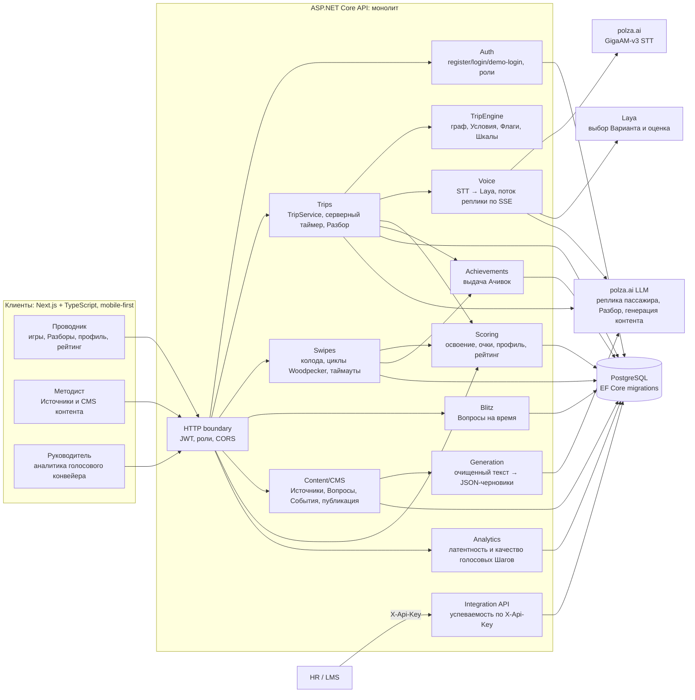
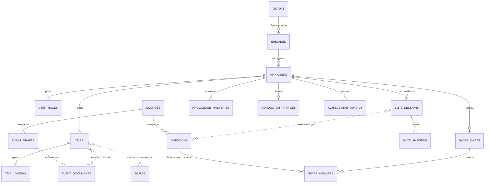
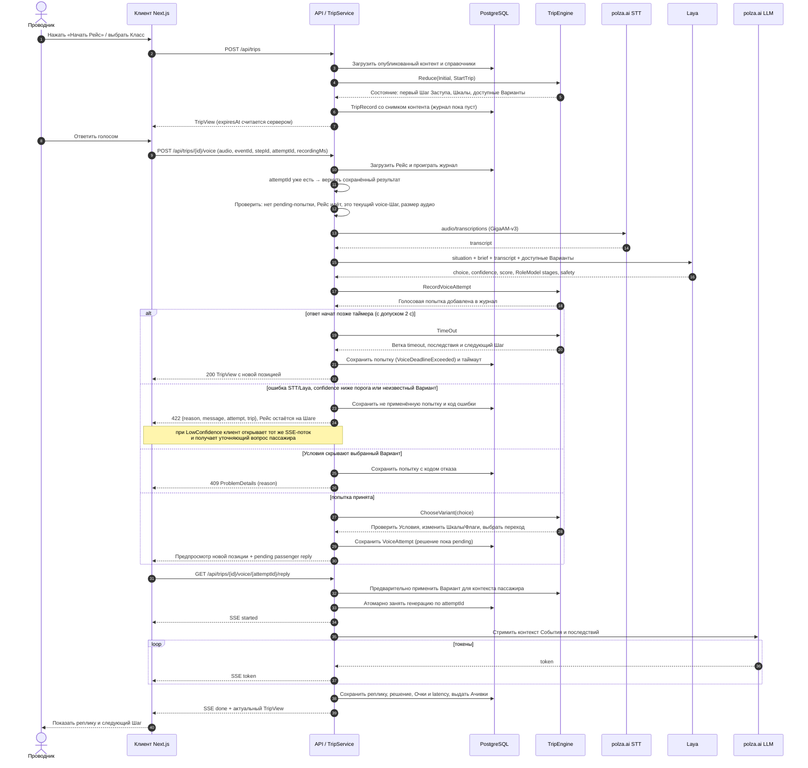
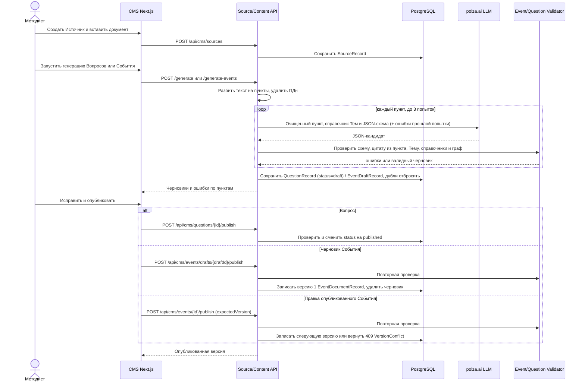
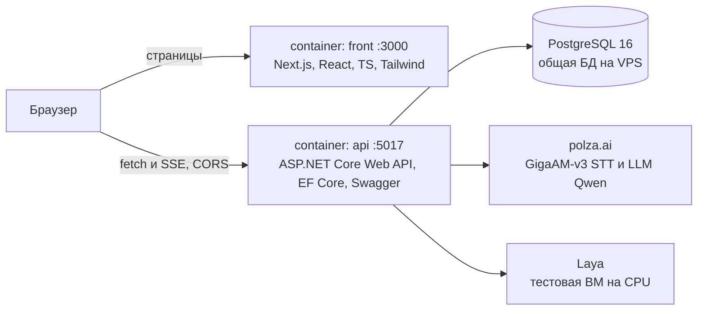

# Архитектура «Турбо-Бригады»

Здесь описано, из чего состоит решение: компоненты (раздел 2), хранение данных (3), голосовой Шаг Рейса (4), подготовка контента в CMS (5), развёртывание (6) и безопасность (7). Запуск описан в [README](../README.md), API для HR — в [integration.md](integration.md), термины — в [CONTEXT.md](../CONTEXT.md), ограничения и план развития — в [limitations-roadmap.md](limitations-roadmap.md).

## 1. Архитектурные решения

- **Frontend и Backend разделены.** Next.js (`front/`) и ASP.NET Core API (`back/`) — отдельные приложения и контейнеры, которые общаются только по HTTP API. Вся игровая логика живёт на бэкенде.
- **Бэкенд — модульный монолит.** Для хакатона выбран один сервис: его проще запускать и отлаживать. Код разбит на модули по папкам (таблица в разделе 2.1), у каждого модуля свои эндпоинты и сервис. Все модули пока работают с одной `AppDbContext`, поэтому перед выносом модуля в отдельный сервис его таблицы нужно отделить.
- **API можно масштабировать горизонтально.** В памяти процесса нет состояния, которое нужно между запросами. JWT работает без серверных сессий, состояние Рейса, Смены и Блица лежит в БД, таймеры считаются от меток времени в БД. Захват генерации реплики пассажира сделан условным `UPDATE`, от гонки двух публикаций События защищает уникальный ключ `(event_id, version)`. Поэтому API можно запустить в нескольких экземплярах за балансировщиком; на стенде работает один экземпляр, несколько экземпляров не проверяли.
- **Сценарии расширяются без правки ядра.** Новое Событие или новая развилка — это JSON-документ, который Методист правит и публикует в CMS, а валидатор проверяет граф до публикации. Шкалы и Классы обслуживания хранятся в справочниках в БД. Ачивки пока заданы списком правил в коде (`AchievementService`).
- **Сервер авторитетен.** Сервер проверяет роль, текущий Шаг, Условия и таймер. Клиент отвечает за отображение и запись голоса, но не может самостоятельно продвинуть Рейс или изменить Шкалы.
- **Движок — редьюсер.** `TripEngine.Reduce(state, action)` не знает о БД, HTTP и часах. Это делает ветвление тестируемым и объяснимым.
- **События версионируются.** Событие хранится целым JSON-документом в `jsonb`; при старте Рейса фиксируются версии Событий, справочники и настройки. Правка CMS не меняет уже начатый Рейс. Вопросы не версионируются: правка меняет запись на месте, поэтому Смена на свайпах и Блиц хранят снимки Вопросов у себя (подробнее в разделе 3).
- **Журнал вместо отдельного снимка состояния.** `TripJournalRecord` хранит действия и результаты, а `TripService` при чтении заново проигрывает журнал на зафиксированном контенте. Так сохраняется полный Разбор и воспроизводимость.
- **Ветвление и Очки определяет граф, а не ИИ.** Голосовая модель переводит аудио в текст. Laya выбирает среди заранее описанных Вариантов и дополнительно оценивает Коммуникацию (вежливость, этапы Ролевой модели, риск нарушения безопасности). Эту оценку видят проводник и Руководитель в аналитике, но на Очки и переходы она не влияет. Переходы и последствия применяет `TripEngine`, Очки начисляются по выбранному Варианту. Текстовая LLM пишет реплику пассажира и объяснение в Разборе (слой Б), но ничего не решает.

## 2. Компоненты решения

Блиц пока не начисляет Очки: ответы сохраняются только в его собственных таблицах. Импорт сотрудников и экспорт в xAPI не сделаны, см. [integration.md](integration.md).

### 2.1. Где что в коде

API описан в Swagger (`/swagger`), для HR — в [integration.md](integration.md).

| Компонент | Код в `back/` | Основные API |
|---|---|---|
| Auth | `Program.cs`, `Data/LoginService.cs`, `Data/JwtTokenService.cs` | `/api/auth/*` |
| Симулятор рейса | `Trips/`: движок `TripEngine.cs`, сервис `TripService.cs` | `/api/trips/*`: `/variant`, `/voice`, `/timeout`, `/proactive`, `/debrief` |
| Голос | `Voice/`: STT, Laya, LLM | multipart `/api/trips/{id}/voice`, SSE `/api/trips/{id}/voice/{attemptId}/reply` |
| Смена на свайпах | `Swipes/` | `/api/swipe-shifts/*` |
| Блиц | `Blitz/` | `/api/blitz-sessions/*` |
| Контент и CMS | `Events/` (граф и валидатор), `Questions/`, `Sources/` | `/api/cms/events/*`, `/api/cms/questions/*`, `/api/cms/sources/*` |
| Генерация | `Sources/*GenerationService.cs` | `/api/cms/sources/{id}/generate`, `/generate-events` |
| Скоринг и Ачивки | `Scoring/`, `Achievements/` | `/api/profile`, `/api/leaderboard`, `/api/achievements` |
| Аналитика | `Analytics/` | `/api/analytics/voice` |
| Интеграция | `Integration/` | `/api/integration/employees/*` по ключу `X-Api-Key` |
| Данные | `Data/`: записи, `AppDbContext`, миграции; `Content/`: стартовый контент | — |

## 3. Хранение данных

Все данные лежат в PostgreSQL, схема меняется только миграциями EF Core. Колонки описаны в `back/Data/*Records.cs`. Сплошная линия — внешний ключ, пунктир — снимок или ссылка через `jsonb` без внешнего ключа.

Ключевые правила хранения:

1. В `EventDocumentRecord` лежит полный граф События; новая публикация создаёт следующую версию.
2. В `TripRecord` лежат снимки справочников, настройки Рейса и `eventId → version`; поэтому исторический Разбор не зависит от текущей CMS.
3. В `TripJournalRecord` одна строка — одна запись журнала: Проактивный выбор (`proactiveChoice`), решение или таймаут на Шаге (`decision`: изменения Шкал, Флаги, критическая ошибка, переход), голосовая попытка (`voiceAttempt`: расшифровка, вердикт и оценка Laya, реплика пассажира, задержки STT/Laya/LLM) и итог События (`eventFinished`). Аудио не сохраняется. Источник для Разбора берётся из версии События, в журнале его нет.
4. Вопросы правятся на месте, поэтому ответ Смены на свайпах хранит снимок Вопроса на момент ответа, а сессия Блица — снимок всей колоды на старте. Изменение опубликованного Вопроса не переписывает историю.

## 4. Последовательность голосового Шага

Это основной сквозной сценарий для демонстрации архитектуры: ветвление выполняет собственный движок, а ИИ подключён как контролируемый адаптер.

### Гарантии сценария

- Таймер считается по часам сервера от `TripRecord.StepStartedAt`. На кнопочном Шаге ответ позже таймера больше чем на 1 с засчитывается как таймаут, а `/timeout` раньше срока отклоняется. На голосовом Шаге таймер — время, чтобы начать отвечать: клиент сообщает только длительность записи `recordingMs` (не больше 60 с), сервер вычитает её из момента прихода аудио и даёт допуск 2 с на загрузку.
- `attemptId` делает повторную отправку идемпотентной: уникальный индекс `(trip_id, voice_attempt_id)`, повтор возвращает сохранённый результат.
- Для принятого голоса используется двухфазное применение: сначала в журнале фиксируется `VoiceAttempt` и клиент получает предпросмотр ветки, затем после успешного SSE-потока коммитятся решение, Очки и реплика пассажира. Пока попытка pending, следующий ход блокируется (`VoiceReplyPending`), кроме таймаута после истечения таймера. Если LLM не ответила или клиент оборвал поток, попытка получает код ошибки и не применяется: Рейс остаётся на Шаге.
- Laya может выбрать только Вариант из переданного списка. Переход, критическая ошибка, пороги Шкал и Срыв вычисляются `TripEngine`.
- Отказ действия в Рейсе — `409 ProblemDetails` с кодом причины в поле `reason` (`StaleStep`, `HiddenVariant`, `TimerNotExpired`, `VoiceReplyPending` и т. п.), по нему UI решает, что показать. Неудачная голосовая попытка возвращает `422` с телом `{reason, message, attempt, trip}`, ошибка в SSE-потоке приходит событием `error` с тем же `reason`. Единого формата ошибок на все модули нет: CMS отвечает своими телами `{message}` и `{reason, latestVersion}`.

## 5. Последовательность подготовки контента

Новый Рейс читает последнюю опубликованную версию; уже начатые Рейсы продолжают использовать свой снимок. Блиц снимает колоду опубликованных Вопросов на старте, Смена на свайпах сохраняет снимок Вопроса в момент ответа.

## 6. Развёртывание

`docker-compose.yml` поднимает `front` и `api`, отдельного контейнера с базой нет: подключение к общей PostgreSQL и секреты приходят из `.env`. Next.js только отдаёт страницы, данные браузер запрашивает у API напрямую по адресу `NEXT_PUBLIC_API_BASE_URL` (по умолчанию `http://localhost:5017`), CORS разрешает origin `localhost:3000`. При старте API применяет EF Core migrations, добавляет недостающий стартовый контент и демо-аккаунты. Swagger доступен, потому что Compose запускает API в режиме Development. Пошаговый запуск описан в [README](../README.md).

## 7. Безопасность и эксплуатационные свойства

- Методы защищены JWT и ролевыми политиками: Рейс доступен любому вошедшему пользователю; Смена, Блиц, профиль, рейтинг и Ачивки — роли Проводника; CMS — Методисту; аналитика — Руководителю. Без токена открыты регистрация, вход, демо-вход и проверка JSON События `/api/events/validate`. Интеграционный API вместо JWT проверяет ключ сервиса в заголовке `X-Api-Key`.
- `/api/auth/demo-login` выдаёт токен трём демо-аккаунтам без пароля (для кнопок «Войти как…» и жюри). По умолчанию он включён; на реальном стенде его нужно выключить настройкой `DemoAccounts:LoginEnabled=false`.
- При генерации CMS-текста вход очищается через `SourceText.RemovePersonalData`; аудиофайл живёт только во время запроса, в БД остаётся расшифровка и метаданные. Голосовая расшифровка сейчас уходит в Laya и LLM (реплика пассажира, объяснение в Разборе) без вычистки. Для промышленного контура тот же scrubber нужно применить к ней до формирования `PassengerReplyContext` и запроса объяснения.
- Голосовые метрики STT/Laya/LLM собираются в журнале и доступны через `/api/analytics/voice`, что позволяет проверять целевую задержку и находить проблемные Шаги.
