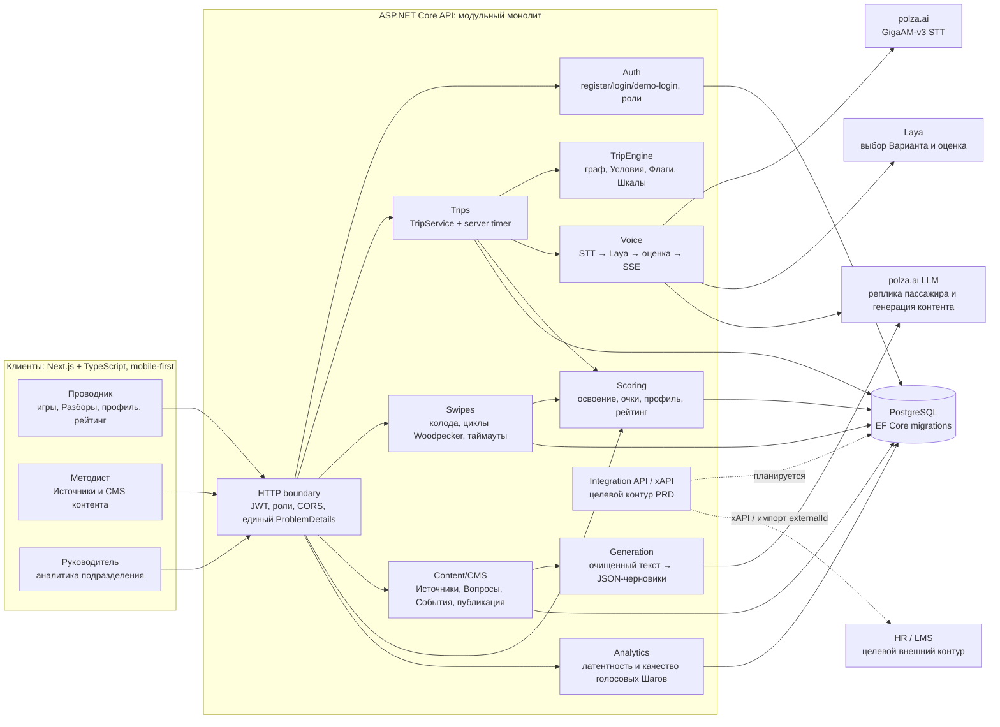
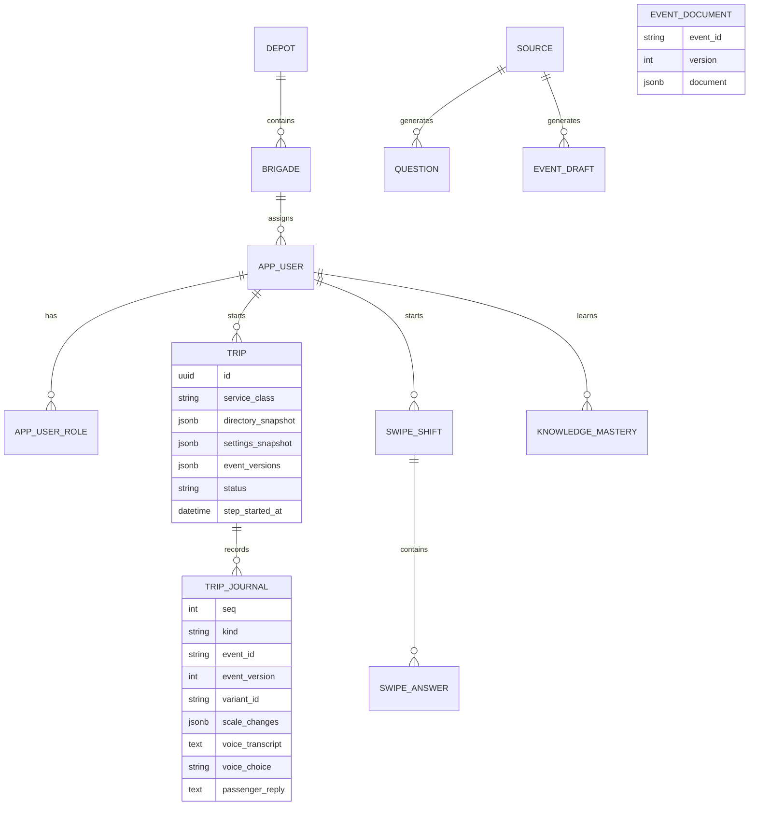
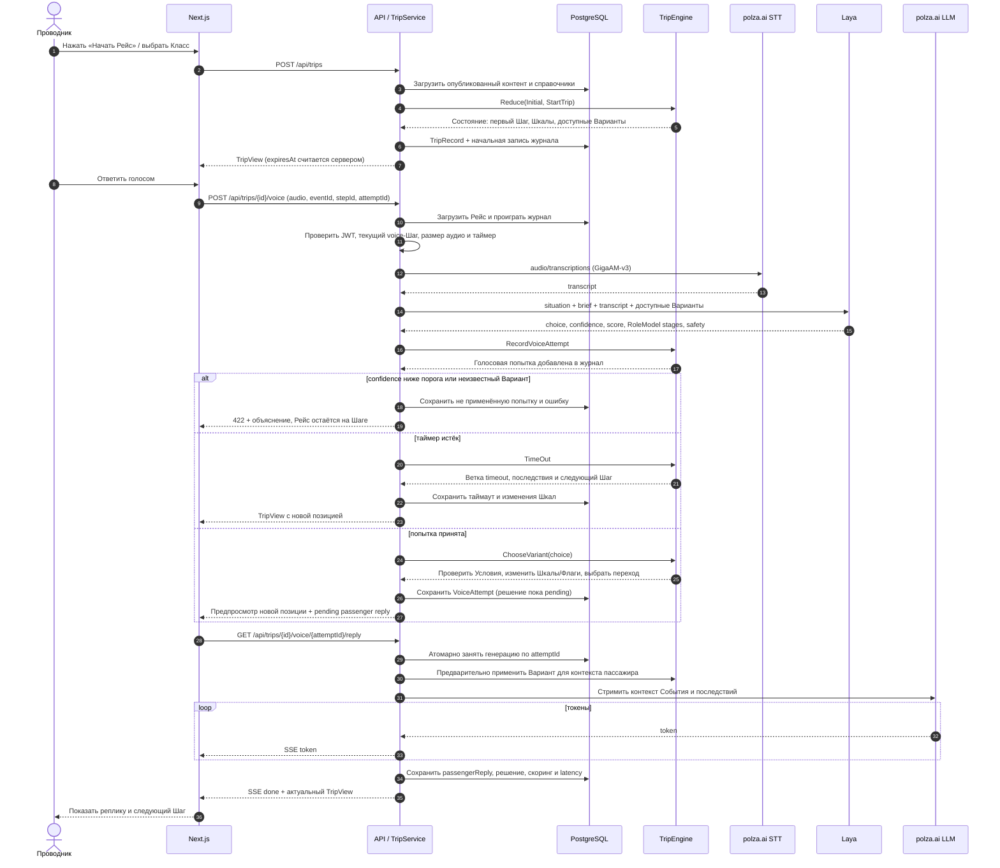
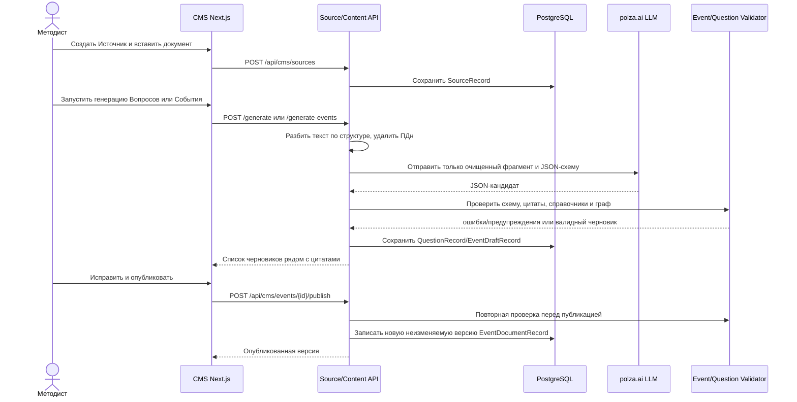
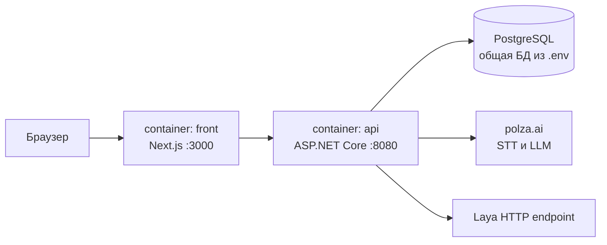

# Архитектура «Турбо-Бригады»

## 1. Архитектурные решения

- **Модульный монолит ASP.NET Core.** Монолит выбран в условиях хакатона, так же разден на модули для возможности миграции на микросервисы
- **Сервер авторитетен.** Сервер проверяет роль, текущий Шаг, Условия и таймер. Клиент отвечает за отображение и запись голоса, но не может самостоятельно продвинуть Рейс или изменить Шкалы.
- **Движок — редьюсер.** `TripEngine.Reduce(state, action)` не знает о БД, HTTP и часах. Это делает ветвление тестируемым и объяснимым.
- **Контент версионируется.** Событие хранится целым JSON-документом в `jsonb`; при старте Рейса фиксируются версии Событий, справочники и настройки. Правка CMS не меняет уже начатый Рейс.
- **Журнал вместо отдельного снимка состояния.** `TripJournalRecord` хранит действия и результаты, а `TripService` при чтении заново проигрывает журнал на зафиксированном контенте. Так сохраняется полный Разбор и воспроизводимость.
- **ИИ не оценивает сотрудников.** Голосовая модель переводит аудио в текст. Laya выбирает среди заранее описанных вариантов. Переходы и последствия применяет алгоритм `TripEngine`. Текстовая LLM формирует реплику пассажира на заданную тему.

## 2. Компоненты решения

### 2.1. Реализация компонентов в коде

| Компонент  | Основные API |
|---|---|
| HTTP boundary и Auth | `/api/auth/*`; Bearer JWT; роли |
| Симулятор рейса | `/api/trips`, `/variant`, `/voice`, `/timeout`, `/proactive`, `/debrief` |
| Голос | multipart `/api/trips/{id}/voice`, SSE `/api/trips/{id}/voice/{attemptId}/reply` |
| Свайпы | `/api/swipe-shifts/*` |
| Контент и CMS | `/api/cms/events/*`, `/questions/*`, `/sources/*` |
| Генерация | `/api/cms/sources/{id}/generate*` |
| Скоринг | `/api/profile`, `/api/leaderboard` |
| Аналитика | `/api/analytics/voice` для роли Руководителя |
| Данные | PostgreSQL |

## 3. Хранение данных

Ключевые правила хранения:

1. В `EventDocumentRecord` лежит полный граф События; новая публикация создаёт следующую версию.
2. В `TripRecord` лежат снимки справочников и `eventId → version`; поэтому исторический Разбор не зависит от текущей CMS.
3. В `TripJournalRecord` сохраняются решения, таймауты, изменения Шкал, Флаги, ссылки на источник и метрики STT/Laya/LLM. Аудио не сохраняется.
4. Для Свайпов ответ дополнительно содержит снимок Вопроса, чтобы изменение опубликованного Вопроса не переписало историю.

## 4. Последовательность голосового Шага

Это основной сквозной сценарий для демонстрации архитектуры: ветвление выполняет собственный движок, а ИИ подключён как контролируемый адаптер.

### Гарантии сценария

- Таймер стартует от `TripRecord.StepStartedAt`; клиентское время не используется
- `attemptId` делает повторную отправку идемпотентной
- Для принятого голоса используется двухфазное применение: сначала в журнале фиксируется `VoiceAttempt` и клиент получает предпросмотр ветки, затем после успешного SSE-потока коммитятся решение, скоринг и реплика пассажира. Пока попытка pending, следующий ход блокируется.
- Laya может выбрать только Вариант из переданного списка. Переход, критическая ошибка, пороги Шкал и Срыв вычисляются `TripEngine`.
- Ответы API с отказом действия используют `ProblemDetails` и код причины (`StaleStep`, `HiddenVariant`, `TimerNotExpired` и т. п.) для управления на UI

## 5. Последовательность подготовки контента

Новый Рейс читает последнюю опубликованную версию; уже начатые Рейсы продолжают использовать свой снимок.

## 6. Развёртывание и границы MVP

`docker-compose.yml` поднимает `front` и `api`; подключение к PostgreSQL и секреты приходят из `.env`, а при старте API применяются EF Core migrations и seed-контент

## 7. Безопасность и эксплуатационные свойства

- Все игровые, CMS и аналитические методы защищены JWT и ролевыми политиками
- При генерации CMS-текста вход очищается через `SourceText.RemovePersonalData`; аудиофайл живёт только во время запроса, в БД остаётся расшифровка и метаданные. Для промышленного контура тот же scrubber нужно применить к голосовой расшифровке до формирования `PassengerReplyContext`.
- Голосовые метрики STT/Laya/LLM собираются в журнале и доступны через `/api/analytics/voice`, что позволяет проверять целевую задержку и находить проблемные Шаги.
