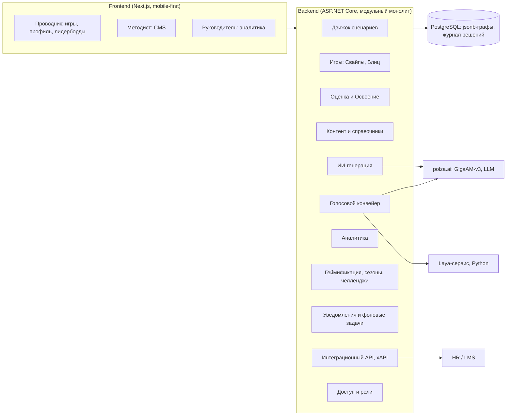

# PRD v7 — «Турбо-Бригада»

**Интерактивный геймифицированный тренажёр для проводников ВСМ.** Трек «Геймификация для ВСМ», сдача **27 сентября 2026, 23:59 МСК**.

| | |
|---|---|
| Версия | 7 (заменяет v6; v6 сохранён без изменений) |
| Дата | 26.09.2026 |
| Основа | Официальное ТЗ → заметки после Q&A с организаторами → прожарка (4 раунда) → PRD v6 |
| Словарь | [CONTEXT.md](../CONTEXT.md) — все термины с заглавной буквы в этом документе определены там |
| Решения | [ADR-0001](adr/0001-event-graph-as-versioned-json-document.md) граф как JSON · [ADR-0002](adr/0002-structured-conditions-and-only.md) условия · [ADR-0003](adr/0003-voice-dialog-pipeline.md) голосовой конвейер · [ADR-0004](adr/0004-competence-points-mastery-based.md) очки по освоению |
| Порядок работ | [mvp-priorities.md](mvp-priorities.md) |
| Открытые вопросы | [open-questions.md](open-questions.md) |

У ключевых решений есть блок «**Почему / Отказались от**»: по критерию 2 любой участник команды должен уметь объяснить, почему сделано именно так.

---

## 1. Видение и цели

ВСМ-400 — крупнейший федеральный проект: за секунду поезд проходит 111 метров, и проводник должен решать за секунды — от конфликта пассажиров до медицинского инцидента. Лекции и тесты не учат работать в стрессе и не развивают гибкие навыки. «Турбо-Бригада» — безопасная среда, где проводник тренирует знания, память и живой разговор с пассажиром, а руководитель видит объективную картину компетенций.

**Цели:**
1. **Снять ступор в ЧС** многократным прохождением ветвящихся ситуаций без риска для пассажиров.
2. **Тренировать память, а не только проверять знания**: интервальные повторения и метод Woodpecker.
3. **Отрабатывать живой разговор голосом** по официальной Ролевой модели общения РЖД.
4. **Давать руководителю и HR объективную обратную связь**: слепые зоны, успехи бригад и депо, качество вопросов. По этим данным HR будет решать о повышении — **рекомендательно**, решение принимает человек.
5. **Мотивировать возвращаться**, а не обязывать: сезоны, челленджи, Рейс дня, коллекции, командные цели.

---

## 2. Роли и пользователи

| Роль | Кто | Что делает |
|---|---|---|
| **Проводник** | Сотрудник поездной бригады, со смартфона | Играет в три игры, смотрит Разборы, профиль, лидерборды |
| **Руководитель** | Начальник бригады или депо, HR | Смотрит аналитику по своему подразделению и карточки проводников |
| **Методист** | Автор контента | Загружает Источники, запускает ИИ-генерацию, правит и публикует контент, настраивает справочники |

Организация (синтетическая): **Компания → Депо → Бригада → Проводник**. Один пользователь может иметь несколько ролей.

---

## 3. Покрытие критериев оценки

| № | Критерий (баллы) | Чем закрываем |
|---|---|---|
| 1 | Движок и механика (6) | Ветвящийся граф с Условиями и Флагами между Событиями; таймер со своей веткой; 2 обязательные Шкалы, расходящиеся по-разному; Срыв рейса; классы меняют пул, чувствительность и таймеры (§5) |
| 2 | Самостоятельность (6) | Собственный движок (ADR-0001), структурированные Условия (ADR-0002), прозрачная модель очков (ADR-0004); «живая правка» развилки в CMS за минуты; инкрементальные коммиты |
| 3 | Геймификация (4) | Замкнутый цикл «действие → очки → Звание, лидерборд → Ачивки, Челленджи → уведомления → возврат» (§11) |
| 4 | Обратная связь и аналитика (4) | Двухслойный Разбор с цитатами регламента и ИИ-объяснением последствий; тепловая карта Тема × Компетенция; выводы текстом (§8, §10) |
| 5 | Архитектура и API (4) | Модульный бэкенд, Swagger, интеграционный API и экспорт в xAPI, docker-compose; справочники вместо хардкода (§13, §15) |
| 6 | Безопасность (3) | Только синтетика, секреты вне git, вычистка ПДн перед LLM, аудио не храним, роли, единый формат ошибок, журнал публикаций (§12) |

---

## 4. Три игры и чему они учат

Игры различаются **целью**, а не уровнем сложности.

| | **Смена на свайпах** | **Блиц** | **Симулятор рейса** |
|---|---|---|---|
| Цель | Тренировка памяти | Знания и скорость реакции | Сложные ситуации и живой разговор |
| Формат | Колода Вопросов с 2 вариантами, свайп влево или вправо, Шкалы как в Reigns | Выбор одного или нескольких ответов, сборка верной последовательности, на время | Голосовой Рейс из ветвящихся Событий |
| Как помогает **запоминать** | Активное припоминание (testing effect); интервальные повторения по Лейтнеру через Личную частоту показа; **Циклы Woodpecker** — та же колода быстрее, чтобы довести правило до автоматизма | Припоминание; **чередование** Тем (interleaving); **чанкинг** — алгоритм ЧС из 3–5 шагов запоминается целиком | **Элаборация** — Разбор объясняет *почему*; эффект генерации — ответ своими словами; опыт последствий без риска |
| **Hard skills** | Правила провоза, документы, запреты, услуги по классам | Алгоритмы ЧС в правильном порядке, нормативы (готовность поезда за 20 мин, ожидание по классам), номера и порядок оповещения | Применение регламента в контексте, взаимодействие с начальником поезда и ПТБ, приоритизация |
| **Soft skills** | Быстрое решение под давлением, стрессоустойчивость (таймер сжимается) | Скорость реакции, внимательность | Коммуникация по Ролевой модели (признание, правило, решение, заверение), вежливость, эмпатия, деэскалация, проактивность, самообладание |
| ИИ во время игры | Нет | Нет | Распознавание речи, Laya-скоринг, реплики LLM |

> **Почему:** три разные цели дают три разных инструмента обучения, а научно подтверждённые механики памяти можно защитить на питче. **Отказались от:** Light/Medium/Hard как уровней сложности одной механики (PRD v6).

---

## 5. Симулятор рейса и движок сценариев

### 5.1. Структура Рейса

```
Заступ на смену (медкомиссия → приёмка поезда)
  → Проактивный выбор → Событие → Проактивный выбор → Событие → …
  → Прибытие  |  Срыв рейса
  → Разбор
```

- **Класс обслуживания** выбирается на старте Рейса: в демо — самим проводником, в «рабочем» режиме его назначает Руководитель.
- **Проактивный выбор** между Событиями: «пройти по вагонам», «проверить техническое», «зайти в служебное». От выбора зависит пул следующего События. «Служебное» при включённой Шкале Ресурса запускает **Минуту выдоха** — дыхательное упражнение, восстанавливающее Ресурс.
- **Длина Рейса:** по умолчанию 3 События после Заступа (настраивается).
- **Событие** — граф Шагов на одну Тему **без жёсткого лимита длины**.

> **Почему:** короткие События проще написать и отредактировать, Проактивный выбор даёт ветвление на уровне Рейса и реиграбельность без гигантских графов. **Отказались от:** одного огромного сценария на весь рейс.

### 5.2. Модель графа События

**Ключи JSON и коды** (Шкал, Флагов, Классов, значений перечислений) — на английском. По-русски пишутся только тексты для людей: ситуация, реплики, текст Варианта, комментарий, названия в справочниках. Ниже русское слово — термин PRD, в скобках — ключ JSON.

| Элемент | Содержит |
|---|---|
| **Шаг** (`steps[]`) | Тип ответа `answerType`: `voice` или `buttons`; описание ситуации `situation`; необязательный таймер `timerSec`. Только для голосовых: Бриф для LLM `brief`, Эталонная реплика `referenceLine`, требуемые этапы Ролевой модели `requiredRoleStages` |
| **Вариант** (`variants[]`) | Описание реакции `text` (для Laya — критерий сопоставления); изменения Шкал `scaleDeltas`; стоимость по Компетенциям `competencies`; этапы Ролевой модели `roleStages` (для кнопок; коды `acknowledge` — Признание, `rule` — Правило, `solution` — Решение, `reassure` — Заверение); **обучающий комментарий** `comment` («почему так, как лучше»); цитата и пункт Источника `source`; выставляемые Флаги `setsFlags`; Условия показа `conditions`; переходы `transitions`; пометка «Критическая ошибка» `criticalError` |
| **Переход** (`transitions[]`) | Упорядоченный список `{ to, conditions }`: срабатывает первый переход, чьи Условия выполнены; хотя бы один переход — без Условий, обычно последний (иначе возможен тупик) |
| **Ветка таймаута** (`timeout`) | Обязательна для каждого Шага с таймером. Устроена как Вариант: свои Шкалы, Флаги, комментарий, переходы. «Замер» — реальный вариант развития |
| **Исход** | Конечный Шаг с полем `outcome`: `success` или `failure`; открывается в Коллекции Исходов. **Шкалы сам не меняет**: Исход — конец События, а не решение; Шкалы меняют Варианты, которые к нему ведут |
| **Флаги** | Выставляются Вариантами, живут в пределах Рейса: решение в Событии 1 открывает или закрывает ветку в Событии 3 |

**Условия** (ADR-0002) — структурированные записи трёх типов: значение Шкалы, наличие Флага, Класс обслуживания. Объединяются **только по «И»**. Применяются к Варианту (показать или скрыть), к переходу и к Событию (фильтр пула). Условие по Классу ссылается на **код** класса, а не на название. Опционально четвёртый тип «случайность» с записью результата броска в журнал.

```json
"conditions": [
  { "type": "scale", "scale": "safety", "op": "<", "value": 40 },
  { "type": "flag",  "flag": "called_train_manager", "present": true },
  { "type": "class", "classes": ["business", "first"] }
]
```

Переход с Условием: Вариант ведёт в разные Шаги в зависимости от состояния Рейса. «ИЛИ» записывается двумя переходами с одной целью.

```json
"transitions": [
  { "to": "report_to_manager", "conditions": [{ "type": "flag", "flag": "did_not_report_drunk", "present": true }] },
  { "to": "s3" }
]
```

**Порядок применения последствий.** Когда проводник выбирает Вариант или истекает таймер, движок:

1. Меняет Шкалы и обрезает их по диапазону справочника. В журнал пишутся оба числа: изменение из контента и фактическое.
2. Ставит Флаги.
3. Пишет решение в журнал.
4. Если у Варианта пометка «Критическая ошибка» — Срыв рейса.
5. Если обязательная Шкала дошла до порога — Срыв рейса. Срыв наступает **раньше перехода**: Событие остаётся без Исхода и получает в журнале статус «прервано».
6. Выбирает первый переход с выполненными Условиями. Условия перехода видят Шкалы и Флаги **после** пунктов 1–2.
7. Если переход ведёт в Исход, Событие завершается.

Условия Варианта проверяются при показе Шага; сервер перепроверяет их при выборе и отклоняет скрытый Вариант.

**Таймер.** Время Шага засекает сервер. Ответ, пришедший позже истечения таймера больше чем на допуск (~1 с на задержку сети), засчитывается как таймаут: срабатывает ветка таймаута, в журнал пишется признак таймаута. Медленный ответ в пределах таймера сохраняет выбранную ветку, но снижает Скорость реакции (§7). Затраченное время пишется в журнал.

**Хранение и исполнение** (ADR-0001): Событие — версионируемый JSON-документ (jsonb) со строгой валидацией при сохранении; полный список проверок — в ADR-0001. Решения игроков пишутся в нормализованный журнал со ссылкой на версию События. **Движок работает на сервере**: время засекает и Шкалы считает бэкенд.

Модель проверена логическим прототипом на Событиях №6 и №33: ветка `prototype/trip-engine`, `prototypes/trip-engine/`.

> **Почему:** JSON удобно генерировать ИИ, править в CMS и показывать как граф; версии сохраняют историю при правках; свой движок — то, что жюри просит объяснить. Английские ключи — потому что русские в C# требуют атрибута на каждом свойстве и смешиваются с латинскими `id`. **Отказались от:** Ink и Yarn Spinner (чужой движок), нормализованного графа в таблицах, исполнения на клиенте (таймер легко обойти), ИЛИ, арифметики и скриптов в условиях, формы перехода «цель + иначе» (только две ветки), собственных Шкал у Исхода (двойной штраф).

### 5.3. Шкалы

Шкалы — **состояние мира в Рейсе**, обнуляются между Рейсами. Ведутся в **справочнике**: код, название, диапазон, старт, порог Срыва, обязательность, включена или нет. Движок работает с N шкалами.

| Шкала | Статус | Механика |
|---|---|---|
| **Лояльность пассажира** | Обязательная | 0–100, старт 70; 0 → Срыв («конфликт с пассажиром») |
| **Рейтинг безопасности** | Обязательная | 0–100, старт 70; 0 → Срыв («авария / инцидент») |
| **Ресурс проводника** | Бонус №1 | Падает от конфликтов и таймаутов; при низком значении **таймеры сокращаются на 20%**; восстанавливается Минутой выдоха |
| **Пунктуальность** | Бонус №2 | Падает от затянутой посадки и задержек отправления |
| **Чистота и порядок** | Бонус №3 | Растёт от проактивных обходов, падает от игнора; при низком значении в пул попадают События-жалобы |

Опциональные Шкалы Срыв не вызывают. Решения обязаны **по-разному** влиять на две обязательные Шкалы: вежливо, но опасно, или безопасно, но грубо.

> **Почему:** критерий 1 проверяет именно расхождение двух шкал; дополнительные шкалы — бонус, который отключается флажком. **Отказались от:** «Вежливости» и «Энергии сервиса» как Шкал. Вежливость — оценка ответа, а не мира, она живёт в Коммуникации (§7).

### 5.4. Исходы и Срыв рейса

- **Неудачный Исход** не прерывает Рейс. Шкалы снижают Варианты, которые к нему ведут; сам Исход Шкалы не меняет.
- **Срыв рейса** немедленно завершает Рейс и открывает Разбор ошибок. Причины: обязательная Шкала = 0; выбран Вариант «Критическая ошибка» (например, «открыть дверь на ходу»); Laya дала признак «нарушение безопасности» выше порога. Событие, в котором случился Срыв, остаётся без Исхода и помечается в журнале как «прервано».
- Какие решения считаются Критической ошибкой, размечает Методист: в «Ситуациях на борту» такой разметки нет.

### 5.5. Классы обслуживания

Классы — **справочник в CMS**: количество, названия, особенности и коэффициенты редактируются. У каждого класса есть неизменный **код** (`standard`, `comfort`, `business`, `first`) и текст для проводника о том, чем класс отличается; этот текст идёт в Бриф LLM и в генерацию Событий и Вопросов. Условия ссылаются на код, поэтому переименование класса их не ломает. По умолчанию 4 класса по СТО РЖД 03.011-2026 (см. приложение Б).

Три рычага влияния класса на игру:
1. **Пул Событий** через Условия: раздача питания и согласование времени подачи — Бизнес/Первый; ребёнок 10–16 лет без сопровождения — Комфорт; торговый автомат — Стандарт; режим «тишины» — Первый.
2. **Чувствительность Лояльности** — множитель штрафа, по умолчанию 1 / 1,2 / 1,5 / 2.
3. **Сжатие таймеров** вслед за нормативом ожидания персонала (20 / 15 / 10 / 5 мин), по умолчанию ×1,0 / 0,9 / 0,8 / 0,7.

Особенности класса (перечень услуг) также попадают в Бриф LLM и в контекст ИИ-генерации.

> **Почему:** класс перестаёт быть декорацией, а «рутина разная» подкреплена стандартом. **Отказались от:** отдельных графов одного События под каждый класс — различия задаются Условиями.

---

## 6. Голосовой диалог (Симулятор рейса)

Голос — **обязательная фича Симулятора**: без голоса игры нет (ADR-0003).

**Конвейер одного голосового Шага:**
1. Проводник видит ситуацию или слышит реплику (пассажир, начальник поезда или описание события).
2. Отвечает **голосом без пауз**. Таймер считает **время до начала речи** (по умолчанию 5 с тишины = таймаут). Конец ответа определяется по паузе ~1,2 с детектором голосовой активности на клиенте.
3. **Распознавание:** GigaAM-v3 через российский ИИ-роутер polza.ai (0,25 ₽/мин), фрагмент уходит после конца речи.
4. **Laya-скоринг** — один проход:
   - `choice` — какому Варианту Шага соответствует ответ, включая провальный с выходом из События;
   - `score` — Вежливость;
   - `noul` × 4 — прозвучали ли этапы Ролевой модели;
   - `noul` — нарушение требований безопасности.
5. Сразу показываем реакцию по вердикту Laya (сдвиг Шкал, эмоция пассажира), чтобы скрыть задержку.
6. **LLM** получает Бриф следующего Шага, вердикт Laya и детерминированно сжатую историю (две последние реплики дословно, Флаги, Шкалы) и **потоком** пишет ответ.

**Кнопочные Шаги** — для «знаниевых» решений: кому звонить, в каком порядке действовать.

**Аварийный фолбэк на питче:** Laya не уверена → кнопки Вариантов; LLM недоступен → Эталонная реплика; распознавание недоступно → текстовое поле.

**Спайк в первый день:** Laya в docker на CPU, 20 русских реплик — проверить качество и задержку. Если результат плохой, голосовые Шаги переводятся на кнопки флагом, граф работает дальше.

> **Почему:** граф решает, Laya маршрутизирует, LLM только формулирует. Поэтому ветвление объяснимо и редактируемо, а смена LLM не меняет логику игры. **Отказались от:** свободного LLM-диалога (PRD v6), Web Speech API (аудио уходит в Google), SpeechKit и Whisper (на русском уступают GigaAM), LLM-суммаризации истории (лишняя секунда).

---

## 7. Оценка

### 7.1. Три оси

| Ось | Вопрос | Значения по умолчанию | Использование |
|---|---|---|---|
| **Тема** (одна на единицу контента) | *О чём* | Медпомощь · Пожарная безопасность · Техника · Посадка и документы · Сервис и питание · Конфликты · Допуск к смене | Выбор и смешивание перед игрой, Процент успеваемости, Покрытие |
| **Категория** (несколько) | *Какого рода* | Штатная · Нештатная · Проактивная забота · Развлекательная · Чёрный лебедь | Сортировка, включение и выключение (например, аттестация без развлекательных) |
| **Компетенция** | *Как справился* | Знание регламента · Скорость реакции · Коммуникация · Проактивность | Очки компетенций, радар в профиле, тепловая карта |

### 7.2. Коммуникация — составная Компетенция

Коммуникация = **Вежливость** + 4 этапа **Ролевой модели общения РЖД**: *Признать ситуацию → Обозначить правило → Предложить решение → Заверить* (источник — «Ситуации на борту»).

- **Вежливость** оценивается в **каждом** ответе (Laya `score`), в Событии берётся среднее.
- **Этапы** засчитываются **за Событие**: каждый один раз, когда впервые прозвучал в любом ответе. Требуемые этапы отмечает автор, по умолчанию все 4. Неуместные этапы не штрафуются: при «пассажиру плохо» Правило не нужно.
- Порядок этапов в MVP не штрафуется, но Разбор его подсвечивает.
- На кнопочных Шагах автор отмечает, какие этапы содержит каждый Вариант.
- Агрегация: *ответ* → журнал и цитата в Разборе; *Событие* → Освоение Коммуникации; *Рейс* → сводка в Разборе; *профиль* → тренд покрытия этапов за последние 10 Рейсов.

Пример профиля: «Коммуникация: вежливость 90% · признание 80% · правило 70% · **решение 40%** · заверение 80%» — сразу видно, чего не хватает.

> **Почему:** оцениваем по официальной модели РЖД, а не по придуманной; требовать 4 этапа в каждой реплике значило бы учить шаблону. **Отказались от:** L.A.S.T. из PRD v6.

### 7.3. Очки компетенций (ADR-0004)

**Очки компетенций = Очки знаний + Бонус регулярности.**

**Единица знания** — Вопрос, Шаг События или (для Коммуникации) Событие целиком. У неё есть стоимость по Компетенциям. **Освоение** ведётся отдельно по каждой Компетенции и определяется **последней** попыткой.

| Было → стало | Очки знаний |
|---|---|
| Впервые верно | + стоимость |
| Впервые неверно | 0 |
| Неверно → верно | + стоимость |
| Верно → неверно | − стоимость |
| Верно → верно / неверно → неверно | 0 |

Когда Единица считается освоенной:
- **Знание регламента** — выбран верный Вариант или ответ.
- **Скорость реакции** — верный ответ быстрее целевого времени (по умолчанию половина лимита).
- **Коммуникация** — в Событии прозвучали все требуемые этапы, и средняя Вежливость выше порога.
- **Проактивность** — выбран Вариант, помеченный автором как проактивный (действие до просьбы пассажира).
- **Чёрный лебедь** — повышенная стоимость Единиц.

**Бонус регулярности:** +10 за день с **завершённой** тренировкой (вход в приложение не считается), потолок X = 100. После 7 дней без практики −5 в день. Это «сгорающие баллы» из ТЗ. X, y и шаг настраиваются в CMS.

**Забывание** учитывается само: Личная частота показа возвращает старые Вопросы, и ошибка в них снимает очки.

HR видит раздельно: «Знания 640 · Регулярность 70/100» — и динамику по ежедневным снимкам.

> **Почему:** одинаковый ответ даёт всем одинаковые очки, проводнику понятно. **Отказались от:** накопительной суммы (не отражает забывание), Эло (непрозрачно), сгорания основных очков.

### 7.4. Процент успеваемости и Покрытие

- **Процент успеваемости** = освоенные / **встреченные** Вопросы и События Темы.
- **Покрытие** = встреченные / все опубликованные в Теме.
- Показываются рядом: «80% при покрытии 20%» честно говорит, что сотрудник видел мало.

---

## 8. Разбор

Разбор **сохраняется** после каждого Рейса и каждой игры.

| Слой | Содержимое | Когда | ИИ |
|---|---|---|---|
| **А. Факты** | Каждое решение, изменения Шкал и очков, обучающий комментарий Варианта, цитата и пункт Источника («по п. 10.5 СТО 03.011…»), какие этапы Ролевой модели прозвучали и какие пропущены (с примером эталонной фразы), время реакции | Сразу | Нет |
| **Б. Объяснение последствий** | Связный рассказ: «из-за этой ошибки могло произойти то-то, поэтому важен именно такой порядок» | Один раз в конце Рейса, асинхронно | Да — опирается на слой А, расшифровки и цитаты |

- Слой Б сохраняется с названием модели и **не перегенерируется**; кнопку «перегенерировать» видит только Методист. **Очки ИИ-текст не меняет.**
- В Свайпах и Блице только слой А.
- История = журнал решений (Шаг, Вариант, время, таймаут, изменения Шкал, вердикт Laya, расшифровка, реплика LLM) + запись Рейса (класс, начало, конец, исход) + сохранённый слой Б. **Аудио не храним.**

> **Почему:** ИИ хорошо объясняет последствия, но генерация при каждом открытии тратит токены и показывает проводнику и HR разные тексты. **Отказались от:** хранения аудио и перегенерации по запросу.

---

## 9. Банк вопросов и игры 1–2

### 9.1. Вопрос

| Поле | Кто задаёт |
|---|---|
| Формулировка; тип (один ответ / несколько / последовательность / свайп из двух) | ИИ или Методист |
| Варианты и верные ответы или верный порядок | ИИ или Методист |
| Тема (одна), Категории (несколько), Классы обслуживания («все» по умолчанию) | ИИ или Методист |
| **Базовая частота показа** | ИИ или Методист |
| Время на ответ | ИИ или Методист |
| Изменения Шкал (для Свайпов) | ИИ или Методист |
| Стоимость по Компетенциям, включая подкомпоненты Коммуникации для каждого варианта | ИИ или Методист |
| Пояснение, цитата, пункт Источника | ИИ (с Источника) |
| Оценка сложности | ИИ (предварительная) |
| **% успешных ответов, фактическая сложность** | **Вычисляется** из ответов |
| **Реальное время ответа** (медиана, доля таймаутов) | **Вычисляется** из ответов |
| **Личная частота показа** | **Вычисляется** для каждого проводника |

> **Почему:** ИИ, выдумывающий статистику, — подделка аналитики, на которую опирается HR. **Отказались от:** поля «% успеха» в выдаче генератора.

### 9.2. Смена на свайпах

- Колода из 20 Вопросов-свайпов, отбор по Личной частоте показа среди выбранных Тем.
- Свайп влево или вправо, Шкалы меняются как в Reigns; смена заканчивается, когда кончилась колода или обнулилась Шкала.
- **Личная частота показа:** верно → ×0,5 (не ниже минимума), неверно → ×2 (не выше максимума).
- **Циклы Woodpecker:** та же колода, таймер 10 → 7 → 5 с.
- После ошибки — одна строка «почему» с цитатой.

### 9.3. Блиц

- Выбор одного или нескольких ответов и **сборка последовательности** (алгоритмы ЧС).
- Таймер на каждый Вопрос, Скорость реакции засчитывается при ответе быстрее целевого времени.
- Темы перемешаны (чередование).

> **Почему:** мультипликативная частота объясняется за 10 секунд и даёт эффект Лейтнера. **Отказались от:** SM-2 и FSRS (избыточно на 2 дня), метода локусов (план развития).

---

## 10. CMS и ИИ-генерация контента

### 10.1. Что есть в CMS

- **Источники:** загрузка, удаление, замена, добавление своих документов. Форматы: вставка текста, .txt, .md, .pdf, .docx, .csv, .xlsx. Старый .doc заранее пересохраняется в .docx.
- **Генерация:** запуск по Источнику, просмотр Черновиков рядом с цитатой, правка, публикация.
- **Банк Вопросов:** список с фильтрами по Теме, Категории и Классу, редактирование, публикация.
- **События:** JSON-редактор с валидатором графа и превью графа; публикация создаёт новую версию.
- **Справочники:** Темы, Категории, Компетенции, **Классы обслуживания** (количество, особенности, коэффициенты), **Шкалы**, правила **Ачивок** и **Челленджей**, пороги **Званий**, параметры Бонуса регулярности (X, y), **Акцент сезона**.
- **Журнал публикаций:** кто и что опубликовал.

### 10.2. Конвейер генерации

1. **Источник** загружен. При удалении Источника удаляются его Черновики, а опубликованный контент **остаётся** с пометкой «источник удалён».
2. **Чанкинг по структуре**: текст режется по разделам и пунктам, таблица — **строка = единица**. Одна строка «Ситуаций на борту» даёт черновик События и 2–3 Вопроса.
3. **Вычистка ПДн** перед отправкой в LLM (ФИО, телефоны, почта, паспортные данные).
4. **Параллельная генерация** (3–4 запроса одновременно), ответ строго по JSON-схеме.
5. **Валидация:** схема → доменные правила (есть верный ответ, Тема из справочника, таймер в пределах) → поиск дубликатов → для Событий валидатор графа. Если ошибки, LLM получает их список и исправляет, максимум 2 попытки.
6. **Прослеживаемость:** у каждого Вопроса и Варианта хранятся цитата и пункт Источника.
7. Всё сгенерированное — **Черновик**. Публикует только Методист, **автопубликации нет**.
8. Документы датасета (СТО 03.011, 03.013, 03.014, «Ситуации на борту») **предзагружены вместе с результатами генерации**. Их можно удалить и сгенерировать заново.

Что генерируется: **Вопросы** — обязательно; **черновики Событий-графов** — после готовности движка (этап 3 в mvp-priorities).

> **Почему:** цитата с пунктом — противоядие от галлюцинаций, и она сразу делает Разбор обучающим; человек в контуре обязателен, потому что по контенту принимаются решения о людях. **Отказались от:** чанков фиксированного размера (режут пункт пополам), автопубликации, каскадного удаления опубликованного, парсинга .doc.

---

## 11. Геймификация и вовлечение

### 11.1. Цикл

Действие (тренировка) → Очки компетенций и Сезонные очки → Звание и лидерборды → Ачивки и Челленджи → уведомления → возврат.

### 11.2. Две валюты

| | Очки компетенций | Сезонные очки |
|---|---|---|
| Смысл | Что ты **знаешь** | Как активно ты **тренировался** в этом месяце |
| Считаются | По освоению (§7.3) | Сумма стоимостей **всех** зачтённых ответов в Сезоне, включая повторы; Темы Акцента ×1,5 |
| Сгорают | Только Бонус регулярности | Обнуляются в конце Сезона |
| Для кого | HR, Звание, общий лидерборд | Азарт, сезонный лидерборд |

Накрутка Сезонных очков ограничена сама: освоенные Вопросы выпадают редко благодаря Личной частоте показа.

### 11.3. Элементы

- **Звания:** Стажёр → Проводник → Старший проводник → Наставник → Эксперт ВСМ, по порогам Очков компетенций. Присваиваются при первом достижении порога и **не отнимаются**.
- **Ачивки** — правила фиксированных типов из справочника. Примеры: «10 верных подряд», «Рейс в Первом классе без Срыва», «все этапы Ролевой модели в одном Событии», «5 Циклов Woodpecker», «Чёрный лебедь пройден», «**Месяц без просадки** Очков компетенций».
- **Лидерборды:** общий (Очки компетенций) и сезонный (Сезонные очки); уровни компания / депо / бригада; отдельно **рейтинг бригад по среднему** — командная готовность.
- **Сезоны:** календарный месяц с необязательным Акцентом («Сентябрь — сезон безопасности»). Сезон вычисляется по дате, отдельная сущность не нужна. В конце Сезона топ-3 каждого уровня получают **постоянный значок** в профиле.
- **Челленджи = Ачивки со сроком** на том же движке правил. Типы: «пройди N Вопросов или Событий Темы T», «Рейс без Срыва в классе K», «все этапы Ролевой модели в N Событиях», «бригадой суммарно N тренировок». Бывают личные и бригадные, срок — неделя, награда — Сезонные очки и значок. **Автоматически по понедельникам:** личный — по самой слабой Теме проводника, бригадный — по самой слабой Теме бригады. Ручное создание формой в CMS — на этапе 2. На главном экране прогресс-бар.

### 11.4. Уведомления

Центр уведомлений в приложении (колокольчик). Push и e-mail — в плане развития.

| Уведомление | Источник | Когда |
|---|---|---|
| Новое Событие | Публикация в CMS → тем, кому оно доступно по Классу и Теме | Сразу |
| Челлендж недели | Автогенерация по самой слабой Теме; Методист может заменить | Понедельник |
| Регулярность сгорает | Ежедневная задача: 7 дней без тренировки | За 1–3 дня до начала сгорания |
| Сезон заканчивается | Календарь сезонов | За 3 дня |
| Ачивка, Звание | Проверка правил после тренировки | Сразу |
| Коллега обогнал; прогресс Цели бригады | Пересчёт лидерборда | Сразу |

Реализация: фоновые задачи бэкенда + таблица уведомлений. **Для демо — кнопка «Прокрутить день» в админке**, чтобы на сцене показать ежедневные и еженедельные задачи.

### 11.5. Механики возврата (хочется, а не обязан)

| Механика | Суть | Приоритет |
|---|---|---|
| **Рейс дня** | Один Рейс для всей компании на день, как Wordle; сравнение с коллегами | MVP |
| **Коллекция Исходов** | «Найдено 2 из 5 концовок» — перепрохождение ради новых веток, прямо использует ветвящийся движок | MVP |
| **Цель бригады** | Общая недельная цель и общая награда; личного наказания нет | MVP |
| Недельная цель | «3 тренировки за неделю» вместо ежедневной серии — без вины при сменном графике | Бонус |
| Минута выдоха | Дыхательное упражнение доступно всегда | Бонус |

**Отслеживание** — блок аналитики «Вовлечённость» (§12.1): доля активных за неделю по бригадам, возврат на 1-й и 7-й день, участие в Рейсе дня, переходы из уведомлений, выполнение Челленджей и Целей бригады, прогресс Коллекции Исходов. Источник — журнал активности.

> **Почему:** цикл замкнут (критерий 3), а HR-оценка не страдает от игровых механик. **Отказались от:** серий со штрафом за пропуск, лутбоксов, дуэлей один на один.

---

## 12. Аналитика для руководителя

### 12.1. Экраны

- **Слепые зоны — тепловая карта:** строки — Темы, столбцы — Компетенции (Коммуникация по клику раскрывается в 5 подкомпонентов). В ячейке доля освоенного от встреченного для выбранной группы (компания / депо / бригада / проводник). Цвет от красного к зелёному, **серый — низкое Покрытие**. Клик открывает худшие Вопросы и Шаги. Технически это HTML-таблица и один SQL-запрос с GROUP BY.
- **Успехи блоков:** сравнение бригад и депо — Очки компетенций, Процент успеваемости по Темам, динамика за 4 недели.
- **Качество контента:**
  - фактическая сложность (% верных);
  - дискриминативность: если сильные отвечают верно не чаще слабых, вопрос, скорее всего, с ошибкой;
  - **реальное время ответа** (медиана, доля таймаутов) с подсказкой: «лимит 10 с, медиана 9,1 с, 30% таймаутов — увеличить до 14 с»;
  - для Событий: где чаще Срыв, какие Варианты никто не выбирает.
- **Карточка проводника для HR:** радар Компетенций, Знания и Регулярность раздельно, динамика, пробелы, история Рейсов с Разборами.
- **Вовлечённость:** метрики из §11.5.
- **Выводы текстом по правилам, без LLM:** «Бригада 3 проседает в Решении (38%) на Теме „Конфликты“».

Везде, где данные могут использоваться для кадровых решений: **«Рекомендация. Решение принимает руководитель»** (ст. 16 152-ФЗ).

> **Почему:** критерий 4 ценит содержательные выводы выше сырого лога; метрики качества закрывают запрос организаторов «сложность и качество вопросов». **Отказались от:** выводов на LLM (недетерминированы).

---

## 13. Архитектура и стек



- **Frontend:** Next.js + TypeScript + Tailwind, mobile-first. Анимации — после функциональности.
- **Backend:** ASP.NET Core, EF Core, схема только через миграции; модули — как на диаграмме. Версия .NET — см. open-questions.
- **Хранилище:** PostgreSQL; графы Событий в jsonb с версиями, журнал решений нормализован.
- **Laya:** отдельный контейнер `laya-serve` (мультиязычный чекпойнт), CPU.
- **Внешние ИИ:** polza.ai — распознавание речи GigaAM-v3 и LLM с выбором модели в настройках.
- **Развёртывание:** docker-compose одной командой, README.
- **Порядок работ:** модель данных → движок + API → CMS → UI игр (подробно в mvp-priorities).

---

## 14. ИИ-модели

| Задача | Модель в MVP | Рекомендуемые открытые веса для контура заказчика |
|---|---|---|
| Распознавание речи | GigaAM-v3 через polza.ai | GigaAM-v3 (MIT) на своём сервере; T-one (Apache 2.0) для потока |
| Оценка ответа | Laya (мультиязычный чекпойнт, Apache 2.0) | То же на GPU |
| Реплика пассажира | Выбирается в настройках | **GigaChat 3.1 Lightning** (10B, 1,8B активных, MIT); альтернатива — Qwen3 14B / 30B-A3B |
| Генерация контента и ИИ-разбор | Выбирается в настройках | **GigaChat 3.5** (432B, 28B активных, MIT); альтернатива — DeepSeek V3.2, Qwen3-235B-A22B |
| **Для сравнения** | В списке выбора с пометкой «для сравнения и представления о возможностях, которых достигнут открытые технологии» | Kimi K3 (2,8T, своя лицензия с ограничениями, нужен кластер), Gemini Live и realtime-модели (речь в речь, закрытые, зарубежные), Nemotron, GLM |

Выбор модели безопасен: переходы и оценки делают граф и Laya, поэтому от LLM логика игры не зависит.

---

## 15. API и интеграции

- **Swagger/OpenAPI** генерируется из бэкенда.
- **Интеграционный API по ключу сервиса**, отдельно от входа пользователей:
  - импорт и обновление сотрудников из HR по `externalId` — только идентификатор, псевдоним, депо и бригада, без ПДн;
  - Компетенции, Процент успеваемости, Покрытие и пробелы по сотруднику и подразделению;
  - **экспорт результатов в формате xAPI** для LMS: «проводник — прошёл — Событие X — результат Y».
- Запись в HR-систему и биллинг **не делаем** — у тренажёра нет платных сущностей. Это отмечено в ограничениях.

---

## 16. Безопасность и соответствие

Юридическую обвязку по согласованию с организаторами не делаем (cookie-баннер, согласия, политика). **Технический минимум критерия 6 делаем:**

1. Только синтетические сотрудники, депо и бригады, имена явно вымышленные.
2. Секреты в `.env`, в репозитории `.env.example`; перед сдачей — проверка на утечки секретов (gitleaks).
3. Вычистка ПДн перед отправкой в LLM; **аудио не храним**, только расшифровку.
4. Роли и авторизация на всех эндпоинтах, пароли хешируются, интеграционный API по отдельному ключу.
5. Предсказуемые ошибки: валидация входа, единый формат ошибок, лимит частоты на ИИ-эндпоинтах, фолбэки ИИ (§6).
6. Журнал публикаций в CMS.
7. Кадровые решения — только рекомендательно (ст. 16 152-ФЗ), с подписью в интерфейсе.

---

## 17. Доступ и демо-данные

- **Вход:** кнопки «Войти как…» для демо плюс простая регистрация (имя, депо и бригада из списка, пароль). Без подтверждения почты и восстановления пароля.
- **Демо-аккаунты:** «Проводник-отличник», «Проводник-новичок» (заранее насчитанная история ~30 тренировок, у каждого свои пробелы), «Руководитель-методист» (две роли).
- **Синтетическая организация:** 2 депо × 3 бригады, ~20 проводников с историей — лидерборды и аналитика выглядят живыми с первой минуты.
- **Кнопка «Прокрутить день»** в админке для демонстрации фоновых задач.

---

## 18. Пользовательские сценарии (User Flow, кратко)

**Проводник:** вход → главный экран (Звание, Очки, Челлендж недели, Рейс дня, колокольчик) → выбор игры и Тем → игра → Разбор → профиль (радар, Коллекция Исходов, Ачивки) → лидерборды.

**Методист:** вход → Источники → загрузка документа → генерация → Черновики рядом с цитатами → правка → публикация → уведомление проводникам уходит автоматически.

**Руководитель:** вход → тепловая карта своего подразделения → клик по красной ячейке → худшие Вопросы и Шаги → карточка проводника → динамика и Разборы.

**Живая правка для жюри (критерий 2):** Методист открывает Событие → меняет переход или изменение Шкалы у Варианта → валидатор → публикация → новый Рейс идёт по новой ветке.

---

## 19. Нефункциональные требования

- Ветвление без задержек: ответ движка на кнопочный Шаг — без заметной паузы, без учёта ИИ.
- Голосовой Шаг: реакция по вердикту Laya — **целевые** ~1,5 с после конца речи, первый токен LLM — ~2 с (уточняется по итогам спайка).
- Модульность: модули бэкенда общаются через явные интерфейсы, новые Шкалы, Классы, Ачивки и типы Условий добавляются без переписывания ядра.
- Запуск одной командой через docker-compose; README с инструкцией.
- Осмысленная история коммитов: инкрементальные изменения, без «мёртвого» кода и TODO-заглушек.

---

## 20. Артефакты сдачи

| Требование ТЗ | Где будет |
|---|---|
| Репозиторий с историей коммитов | GitHub `MolinRE/TurboSquadApp` |
| Прототип, запускаемый по README, локальное развёртывание | docker-compose + README |
| Архитектура (компоненты и последовательность) | `docs/architecture.md`: диаграмма §13 + последовательность голосового Шага |
| API (Swagger/Markdown) | Swagger + `docs/api.md` с интеграционными сценариями |
| User Flow и примеры сценариев | `docs/user-flow.md` + примеры Событий в JSON |
| Ограничения и план развития | §21 этого документа → `docs/limitations-roadmap.md` |

---

## 21. Ограничения решения и план развития

**Ограничения MVP:**
- Распознавание речи и LLM — через внешний российский роутер (нужен интернет и ключ).
- Laya на CPU: задержка выше заявленных 33 мс (это цифра для GPU).
- Уведомления только внутри приложения.
- Биллинга и записи в HR-систему нет.
- Порядок этапов Ролевой модели не штрафуется.
- Контент ограничен предзагруженными Источниками и демо-Событиями.

**План развития:**
- Локальное развёртывание GigaAM-v3, Laya на GPU и LLM с открытыми весами (GigaChat 3.x) в контуре Московского транспорта.
- Синтез голоса пассажира (TTS), push и e-mail уведомления.
- Визуальный редактор графа, генерация Событий-графов «под ключ».
- Метод локусов («вагон как дворец памяти»), недельные цели, Минута выдоха как отдельный раздел.
- Маломобильные пассажиры (СТО 03.014) как отдельная Тема.
- Двусторонняя интеграция с HR и LMS, SSO.

---

## 22. Что изменилось относительно v6

| Было в v6 | Стало в v7 | Причина |
|---|---|---|
| Light / Medium / Hard — уровни сложности | Три игры с разными целями: Свайпы (память), Блиц (знания и реакция), Симулятор рейса | Заметки Q&A |
| Hard: свободный LLM-чат, оценка Laya по L.A.S.T. | Голосовой ветвящийся граф: Laya маршрутизирует, LLM формулирует | ТЗ (критерий 1), заметки, ADR-0003 |
| Ветвление только в Hard | Движок Рейса и Событий с Условиями, Флагами, таймаутами, Срывом | Критерий 1, «организаторы хотят сценарии в первую очередь» |
| Шкалы: Пунктуальность, Энергия сервиса, Скорость, Вежливость | 2 обязательные Шкалы ТЗ + справочник опциональных | ТЗ |
| 6 «категорий» | Три оси: Тема, Категория, Компетенция | Прожарка |
| — | Составная Коммуникация по Ролевой модели РЖД | «Ситуации на борту» |
| Очки только растут | Очки по освоению + Бонус регулярности; Звания; Сезоны | Прожарка, ADR-0004 |
| Пайплайн PDF → LLM → JSON | Источники, чанкинг по структуре, вычистка ПДн, валидация, цитаты, Черновики | Заметки: генерация обязательна |
| Нет классов обслуживания | Справочник классов по СТО 03.011 с тремя рычагами | Заметки, СТО |
| Нет аналитики руководителя | Тепловая карта, качество контента, реальное время ответа, карточка для HR, Вовлечённость | Заметки |
| «Без авторизации, дефолтная сессия» | Роли, демо-аккаунты, простая регистрация | Заметки |
| UI-first на мок-JSON | Сначала модель данных и движок | Заметки |
| Нет уведомлений, API, безопасности | Уведомления, интеграционный API и xAPI, технический минимум критерия 6 | ТЗ |
| STT и LLM: YandexGPT / GigaChat | GigaAM-v3 и выбор LLM через polza.ai | Прожарка |

---

## Приложение А. Кандидаты Событий для демо

Источник — «Ситуации на борту» (номера — номера ситуаций). Окончательный выбор — в open-questions.

| Событие | Тема | Класс | Чем интересно движку |
|---|---|---|---|
| Заступ: медкомиссия и приёмка поезда (готовность за 20 мин) | Допуск к смене | Все | Таймер, Флаг «замечание по вагону» влияет на следующие События |
| №19 Пассажиру стало плохо | Медпомощь | Все | Критическая ошибка (дать личные лекарства — №28), вызов НП, громкая связь |
| №6 / №21 Нетрезвый пассажир | Конфликты | Все | Расхождение Шкал: «не говорить по рации, что пьян» |
| №33 Два пассажира на одно место | Посадка и документы | Все | Ролевая модель целиком, вызов НП |
| №41 Бесхозная вещь | Пожарная безопасность / ПТБ | Все | Строгий алгоритм — кандидат для Блица-последовательности |
| №7 Блюда нет, хотя оно в меню | Сервис и питание | Бизнес / Первый | Условие по классу, извинение и комплимент |
| №29 Паническая атака | Медпомощь | Все | Дыхание «по квадрату» — связь с Минутой выдоха |
| №20 Курение в тамбуре | Пожарная безопасность | Все | Безопасность vs лояльность |

## Приложение Б. Классы обслуживания по СТО РЖД 03.011-2026

| | Стандарт | Комфорт | Бизнес | Первый |
|---|---|---|---|---|
| Доп. услуги | За плату | Часть включена | Расширенный перечень | Персональный подход, изолированное пространство |
| Питание | Кулер, торговые автоматы | Частично (уточнить) | Напитки, закуски, десерт на месте с тележки; особое меню | + горячее питание; время подачи согласуется с каждым; напитки без ограничений; фарфор; заказ из бистро |
| Ожидание персонала | ≤ 20 мин | ≤ 15 мин | ≤ 10 мин | ≤ 5 мин |
| Особое | — | Дети 10–16 лет без сопровождения | Уборка каждые 30 мин, детские наборы | Помощь с одеждой и багажом, сейф, отпариватель, режим «тишины», переговорная |
