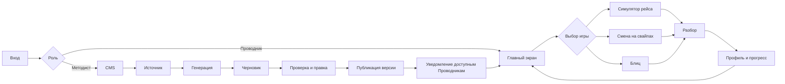
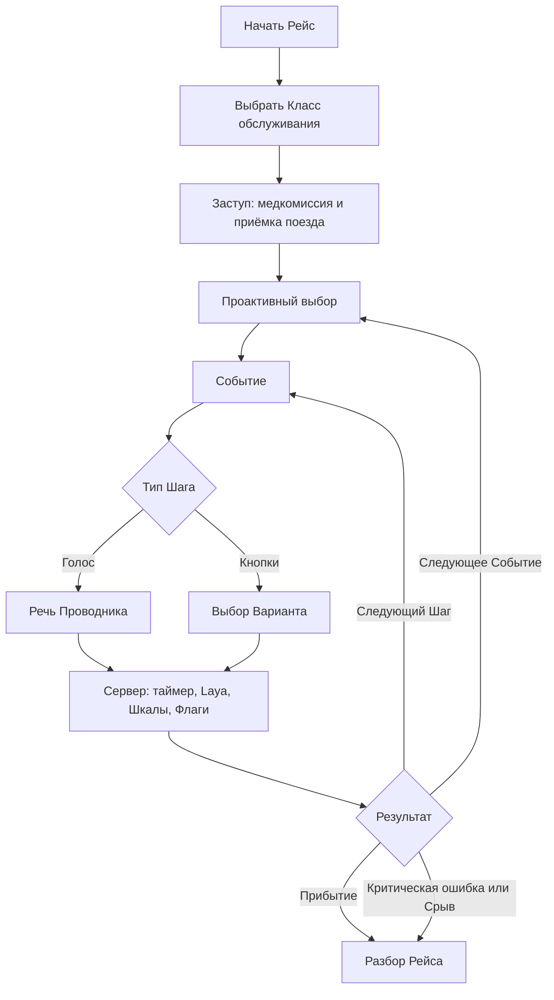
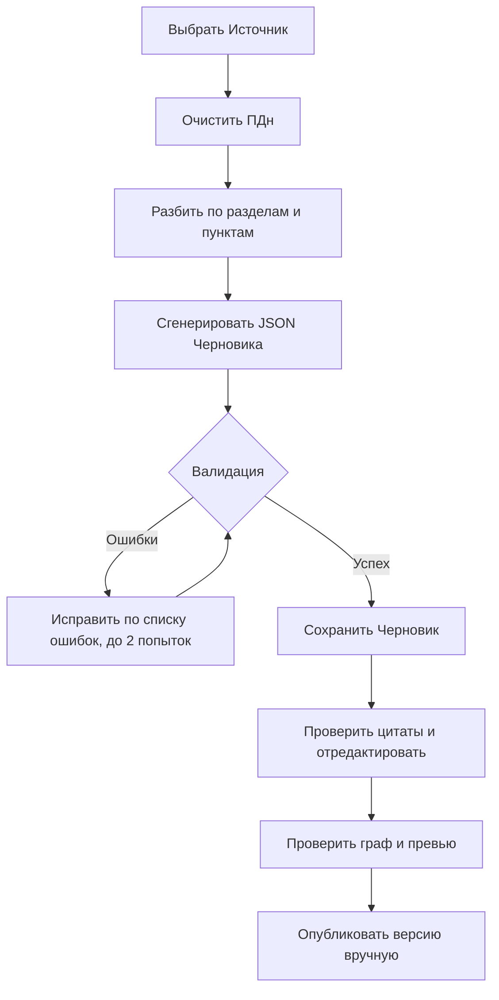

# User Flow «Турбо-Бригада»

Документ описывает пользовательские сценарии для двух основных ролей демо:

- **Методист** создаёт и публикует учебный контент в CMS.
- **Проводник** проходит игровые тренировки со смартфона и изучает Разборы.

Сценарии соответствуют PRD v7. Все термины с заглавной буквы используются в значении, заданном в [CONTEXT.md](../CONTEXT.md).

## 1. Общие условия

1. Пользователь входит в приложение под синтетической учётной записью. В рабочем режиме роли и принадлежность к организации задаются через интеграцию, в демо — тестовыми данными.
2. В Рейсе используются опубликованные События, подготовленные Методистом заранее. В демо Проводник может выбрать Класс обслуживания; в рабочем режиме Класс назначает Руководитель.
3. Таймер, Шкалы, Условия, Флаги и переходы рассчитывает серверный движок. Клиент показывает текущее состояние и отправляет действие пользователя.
4. Любой сгенерированный ИИ контент сначала получает статус **Черновик**. Автоматической публикации нет.
5. После тренировки сохраняется Разбор. Аудио голосовых ответов не хранится; в журнале остаются расшифровка, вердикт Laya, время и выбранный Вариант.

## 2. Карта пользовательских путей

## 3. Сценарий Проводника

### 3.1. Основной путь

| Шаг | Действие Проводника | Реакция приложения | Результат |
|---|---|---|---|
| 1. Вход | Вводит данные синтетической учётной записи | Проверяется роль и принадлежность к организации | Открывается Главный экран |
| 2. Главный экран | Смотрит Звание, Очки компетенций, Бонус регулярности, Челлендж недели, Рейс дня и уведомления | Показываются доступные тренировки и прогресс целей | Проводник выбирает, что тренировать |
| 3. Выбор игры | Открывает Симулятор рейса, Смену на свайпах или Блиц | Показывается цель игры и доступные Темы | Проводник выбирает игру |
| 4. Настройка | Выбирает Темы и, если это демо, Класс обслуживания | Формируется доступный пул опубликованного контента | Создаётся игровая сессия |
| 5. Тренировка | Отвечает голосом, кнопкой, свайпом или собирает последовательность | Сервер проверяет время и Условия, применяет Шкалы, Флаги и переход | Игра переходит к следующему Шагу или завершается |
| 6. Итог | Просматривает исход, очки и награды | Записываются результат, журнал решений и прогресс | Открывается Разбор |
| 7. Разбор | Изучает ошибки, цитаты Источников и рекомендации | Показывается слой А; для Рейса после генерации — слой Б с объяснением последствий | Проводник понимает, что повторить |
| 8. Возврат | Переходит в Профиль, Коллекцию Исходов, Лидерборд или новую тренировку | Обновляются Звание, Ачивки, Челленджи и уведомления | Замыкается цикл «тренировка → обратная связь → возврат» |

Если пользователь закрыл страницу в середине Смены на свайпах, сессия может продолжиться в том же браузере. Для Рейса состояние хранится на сервере.

### 3.2. Симулятор рейса

#### Последовательность одного Рейса

1. Проводник выбирает Класс обслуживания. Класс определяет доступные События, особенности сервиса и чувствительность некоторых Шкал.
2. Проходит обязательное стартовое Событие **Заступ на смену**: медкомиссия и приёмка поезда.
3. Перед каждым Событием делает Проактивный выбор: например, «пройти по вагонам», «проверить техническое» или «зайти в служебное».
4. В Событии последовательно получает Шаги. Голосовой Шаг требует ответа без пауз; кнопочный Шаг используется для выбора действия или порядка оповещения.
5. Сервер проверяет таймер, применяет `scaleDeltas`, выставляет Флаги и выбирает первый подходящий переход. Голосовой ответ дополнительно проходит распознавание и Laya-скоринг.
6. При таймауте срабатывает отдельная ветка `timeout`. При Критической ошибке или достижении нулевого значения обязательной Шкалы происходит Срыв рейса до перехода в следующий Шаг.
7. После запланированного числа Событий Проводник прибывает или получает Срыв рейса. В обоих случаях открывается Разбор.

#### Пример 1. Событие `sit-06`: пассажир с признаками алкогольного опьянения

**Цель:** отработать спокойную коммуникацию, своевременное информирование начальника поезда и безопасную эскалацию.

Начальные значения обязательных Шкал Рейса: Лояльность пассажира — 70, Рейтинг безопасности — 70.

| Шаг | Что видит и делает Проводник | Ветка движка и последствия |
|---|---|---|
| `s1`, голос, 20 секунд | В вагоне пассажир громко разговаривает, от него пахнет алкоголем. Проводник спокойно говорит: «Прошу Вас соблюдать спокойствие и не создавать неудобств другим пассажирам» | Вариант `a`: Лояльность +5, Безопасность +5, фиксируется этап Ролевой модели. Переход в `s2` |
| `s1`, альтернативный ответ | Проводник не подходит к пассажиру | Лояльность +5, Безопасность −15, переход в `s3`. Пассажир может начать конфликтовать |
| `s1`, таймаут | Проводник не начал говорить за отведённое время | Ветка `timeout`: Лояльность −10, Безопасность −10; пассажир начинает спорить с соседом |
| `s2`, кнопки | Проводник вызывает начальника поезда нейтрально: «Прошу подойти в пятый вагон» | Безопасность +10, Событие заканчивается успешным Исходом `ok` |
| `s2`, ошибка | Проводник не сообщает о пассажире, потому что тот временно успокоился | Выставляется Флаг `did_not_report_drunk`, Безопасность −20, Исход `fail_quiet` |
| `s3`, голос, 15 секунд | Пассажир повышает голос и задевает соседей. Проводник не спорит, вызывает начальника поезда и ПТБ | Безопасность +10, но конфликт уже развился; Исход `fail_escalated` |
| `s3`, критическая ошибка | Проводник вступает в спор и пытается вывести пассажира самостоятельно | Вариант помечен `criticalError`; Рейс немедленно получает Срыв |

В Разборе Проводник видит расшифровку ответа, время реакции, изменения обеих Шкал, цитату из Источника и пропущенные этапы Ролевой модели. Слой Б объясняет, почему нейтральный вызов по рации снижает риск эскалации.

#### Пример 2. Событие `sit-33`: два пассажира на одно место

**Цель:** пройти полный цикл Ролевой модели общения и увидеть зависимость Варианта от Класса обслуживания.

1. На голосовом Шаге Проводник признаёт ситуацию и просит предъявить оба билета. Успешный Вариант даёт по +5 к Лояльности и Безопасности и фиксирует этап **Признание**.
2. После проверки документов Проводник обозначает правило и сообщает, что приглашает начальника поезда. Фиксируются этапы **Правило** и **Решение**.
3. Когда выясняется, что в поезде есть свободные места, Проводнику показываются доступные Варианты. Вариант с повышением Класса без доплаты доступен для Стандарта, Комфорта и Бизнеса по Условию `class`.
4. После согласия пассажира Проводник заверяет его: «Благодарю Вас за понимание и ожидание». Фиксируется этап **Заверение**.
5. При достаточной Лояльности открывается успешный Исход «оба пассажира на своих местах». Если после предыдущих решений Лояльность ниже 40, открывается неуспешный Исход «пассажир пересел, но остался недоволен».

Так один и тот же граф показывает разные ветки в зависимости от ответов, Класса обслуживания и состояния Шкалы. Неуспешный Исход сам по себе не обрывает весь Рейс; Срыв вызывают только Критическая ошибка или обязательная Шкала на пороге.

### 3.3. Смена на свайпах

1. Проводник выбирает одну или несколько Тем.
2. Приложение формирует колоду из 20 Вопросов с учётом Личной частоты показа.
3. На каждой карточке Проводник свайпает влево или вправо. Ответ сразу меняет Шкалы как в Reigns.
4. После ответа показывается одна строка «почему» и цитата с пунктом Источника.
5. Верный ответ уменьшает Личную частоту показа Вопроса, ошибка увеличивает её. Так старые и сложные Вопросы возвращаются чаще.
6. Смена завершается после колоды или Срыва смены. В Разборе доступны ошибки и режим «Работа над ошибками».

**Игровой пример — провоз собаки без переноски:**

- Карточка: «Пассажир просит провезти собаку без переноски: она спокойная. Разрешить?»
- Свайп влево «Предложить переноску» — правильный Вариант, Рейтинг безопасности +5.
- Свайп вправо «Разрешить» — Лояльность +5, Рейтинг безопасности −15.
- После карточки показывается правило «питомцев провозят только в переноске» и ссылка на «Ситуации на борту, №4».

### 3.4. Блиц

1. Проводник выбирает Темы и запускает короткую серию Вопросов.
2. На каждом Вопросе выбирает один или несколько ответов либо собирает правильную последовательность.
3. Таймер ограничивает время. Скорость реакции засчитывается, если ответ быстрее целевого времени.
4. Темы чередуются, чтобы Проводник не решал подряд однотипные задачи.
5. В Разборе показываются правильный порядок, ответ Проводника и цитата Источника.

**Игровой пример — бесхозная вещь, Событие №41:** Проводник перетаскивает действия в последовательность, установленную Источником. Движок сравнивает порядок, начисляет Очки знаний и показывает, на каком шаге алгоритма допущена ошибка. Такой формат тренирует запоминание алгоритма ЧС без риска для реального поезда.

### 3.5. Итог, Разбор и возврат

После завершения игры Проводник получает:

- исход тренировки: Прибытие, Срыв рейса, Смена пройдена или Срыв смены;
- изменения обязательных и дополнительных Шкал;
- Очки компетенций и Сезонные очки;
- прогресс Бонуса регулярности, Челленджей, Ачивок и Звания;
- ссылку на сохранённый Разбор.

**Слой А Разбора** доступен сразу: каждое решение, время, таймаут, изменение Шкал, выбранный Вариант, цитата и пункт Источника, а для голоса — расшифровка, оценка Вежливости и этапы Ролевой модели.

**Слой Б Разбора Рейса** создаётся один раз асинхронно: связное объяснение последствий действий на основе фактов слоя А. Очки от текста ИИ не зависят.

После Разбора Проводник может:

1. повторить ошибочные Вопросы;
2. открыть Коллекцию Исходов и пройти другую ветку;
3. посмотреть радар Компетенций и историю Рейсов в Профиле;
4. сравнить Очки с бригадой, депо или компанией;
5. вернуться к Рейсу дня или Челленджу недели.

## 4. Сценарий Методиста

### 4.1. Основной путь публикации

| Шаг | Действие Методиста | Реакция CMS | Контроль результата |
|---|---|---|---|
| 1. Вход | Входит с ролью Методиста | Открывается рабочее место CMS | Остальные роли не получают права публикации |
| 2. Источник | Вставляет текст или загружает документ | Источник сохраняется в библиотеке | Название, тип и содержимое доступны для генерации |
| 3. Генерация | Выбирает генерацию Вопросов, Событий или обоих типов и LLM для сравнения | Текст режется по структуре, ПДн очищаются, запросы выполняются параллельно | В ответе ожидается JSON по схеме |
| 4. Валидация | Ждёт завершения обработки | Проверяются схема, доменные правила, дубликаты и граф События; при ошибках возможны до двух исправлений | Ошибки видны Методисту; публикация не запускается автоматически |
| 5. Проверка Черновика | Открывает карточку рядом с цитатой Источника | Можно изменить формулировки, Тему, Категории, Класс, таймер, Варианты и комментарии | Каждый Вариант имеет проверяемое обоснование |
| 6. Граф и превью | Для События открывает JSON-редактор и превью графа | Видны Шаги, переходы, условия, ветка таймаута и Исходы | Нет тупиков, есть исходы и обязательная ветка без Условий |
| 7. Публикация | Нажимает «Опубликовать» | Создаётся первая или следующая версия, запись попадает в Журнал публикаций | В Рейс попадает только опубликованная версия |
| 8. Уведомление | Завершает публикацию | Уведомление уходит Проводникам, которым Событие доступно по Классу и Теме | Новый контент появляется на Главном экране и в игре |

### 4.2. Генерация События из Источника

Для каждого Вопроса и Варианта сохраняются цитата и пункт Источника. Если Методист удаляет Источник, его Черновики удаляются, а опубликованный контент сохраняется с пометкой «Источник удалён».

### 4.3. Пример работы Методиста: публикация События №6

**Задача:** добавить тренировку по ситуации «Пассажир с признаками алкогольного опьянения».

1. Методист открывает раздел **Источники**, вставляет текст «Ситуации на борту» и сохраняет документ.
2. В разделе **Генерация** выбирает источник и тип «События». Система создаёт Черновик с Темой «Конфликты» и Категорией «Нештатная».
3. Методист открывает граф и проверяет:
   - голосовой `s1` с таймером 20 секунд;
   - варианты спокойной реплики, бездействия и эскалации;
   - ветку `timeout`;
   - кнопочный `s2` с обязательным вызовом начальника поезда;
   - голосовой `s3` с Критической ошибкой при самостоятельном выводе пассажира;
   - Исходы `ok`, `fail_quiet`, `fail_escalated`;
   - комментарии, цитаты и пункты Источника.
4. Если генератор предложил сказать по рации, что пассажир пьян, Методист меняет комментарий и Варианты: нейтральный вызов повышает Безопасность, разглашение состояния пассажира снижает Лояльность.
5. Валидатор проверяет JSON, ссылки переходов и наличие ветки без Условий. Методист сохраняет Черновик и просматривает превью.
6. После ручной проверки Методист публикует версию. Проводники с доступной Темой получают уведомление и видят Событие в пуле Симулятора.
7. Методист открывает Журнал публикаций и может показать жюри, кто, когда и какую версию События опубликовал.

### 4.4. Пример создания Вопроса для Смены на свайпах

Методист открывает **Банк Вопросов** и проверяет карточку:

| Поле | Значение примера |
|---|---|
| Формулировка | «Пассажир просит провезти собаку без переноски. Разрешить?» |
| Тип | Свайп из двух вариантов |
| Тема | Посадка и документы |
| Правильный Вариант | «Предложить переноску» |
| Время | 10 секунд |
| Шкалы | Правильный: Безопасность +5; ошибка: Безопасность −15, Лояльность +5 |
| Пояснение | «Питомцев провозят только в переноске» |
| Источник | «Ситуации на борту, №4» |

Методист проверяет, что объяснение подтверждено цитатой, сохраняет Черновик и публикует его. В следующей Смене карточка появляется у Проводника, а после ответа участвует в расчёте Личной частоты показа.

### 4.5. Живая правка опубликованного графа

1. Методист открывает опубликованное Событие и создаёт новую версию.
2. Меняет переход, Условие, изменение Шкалы или текст обучающего комментария.
3. Запускает валидатор и проверяет превью новой ветки.
4. Публикует новую версию вручную.
5. Новые Рейсы используют опубликованную версию, а уже завершённые Разборы сохраняют ссылку на версию, которая была активна в момент прохождения.

Так Методист может за несколько минут изменить развилку для демонстрации жюри, не переписывая код движка.

## 5. Состояния и обработка ошибок

| Ситуация | Что происходит | Что видит пользователь |
|---|---|---|
| Вариант скрыт Условием | Сервер повторно проверяет Условия и отклоняет недоступный выбор | Сообщение об устаревшем состоянии, игра не продвигается |
| Ответ пришёл после таймера | Применяется ветка `timeout`, время и признак таймаута попадают в журнал | Последствие «замера» и обучающий комментарий |
| Обязательная Шкала достигла нуля | Рейс или Смена завершается до следующего перехода | Срыв и Разбор без несуществующего Исхода |
| Выбран Вариант с `criticalError` | Рейс немедленно прерывается | Критическая ошибка, её последствие и рекомендация |
| Низкая уверенность Laya, ошибка распознавания или недоступна LLM | Попытка считается неуспешной, Вариант не применяется, Рейс не продвигается | Сообщение об ошибке и возможность повторить шаг |
| Черновик не проходит валидацию | Публикация блокируется | Список ошибок схемы, доменных правил или графа |
| В Источнике найдены ПДн | Перед отправкой в LLM данные очищаются | В журнале остаётся факт очистки; исходный Источник доступен только авторизованному Методисту |

## 6. Что считается успешным прохождением User Flow

### Для Проводника

- он может выбрать игру и Тему, начать тренировку и завершить её Прибытием или корректным Срывом;
- каждое действие получает объяснимое последствие: время, Вариант, Шкалы, Флаги и Очки;
- после тренировки доступен Разбор с цитатой Источника и понятной рекомендацией;
- прогресс отражается в Профиле, Челленджах, Ачивках и Лидербордах;
- новая опубликованная тренировка приходит через Центр уведомлений.

### Для Методиста

- он может загрузить Источник, получить Черновики Вопросов и Событий и увидеть цитаты;
- он может вручную исправить контент, переходы, Условия, таймеры и Шкалы;
- валидатор не позволяет опубликовать невалидный граф;
- публикация создаёт версию, пишет запись в Журнал и делает контент доступным нужным Проводникам;
- новая версия меняет поведение будущих Рейсов, не переписывая историю завершённых прохождений.
