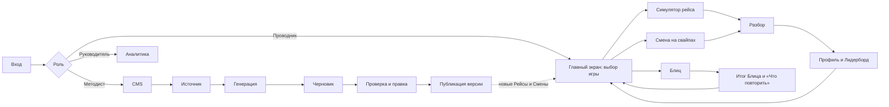
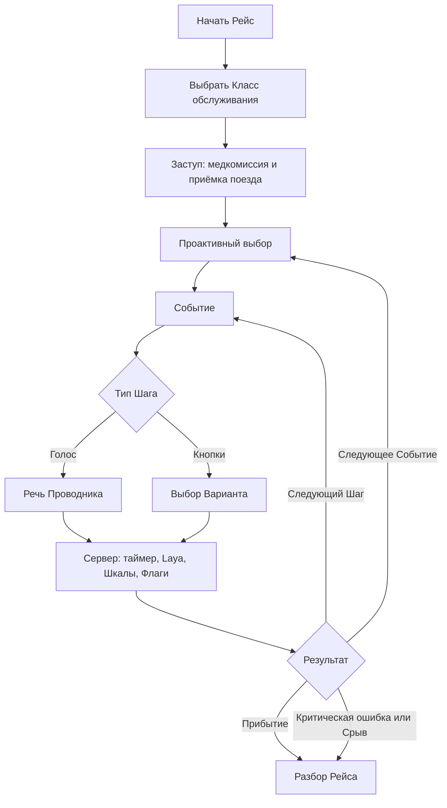
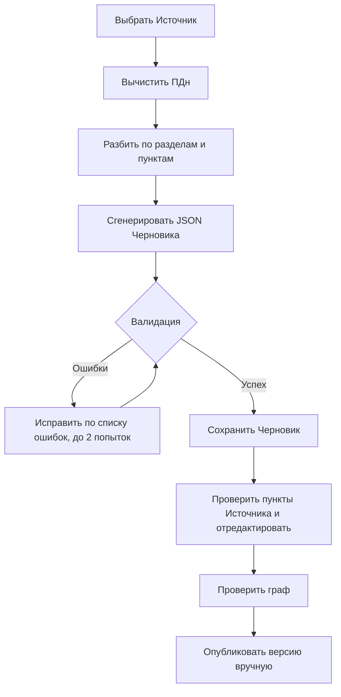

# User Flow «Турбо-Бригада»

Документ описывает пользовательские сценарии трёх ролей демо:

- **Проводник** проходит игровые тренировки со смартфона и изучает Разборы.
- **Методист** создаёт и публикует учебный контент в CMS.
- **Руководитель** смотрит аналитику. В демо эта роль совмещена с Методистом.

Термины с заглавной буквы (Рейс, Событие, Шаг, Вариант, Исход) объяснены в словаре [CONTEXT.md](../CONTEXT.md). Что в MVP не сделано, собрано в [limitations-roadmap.md](limitations-roadmap.md).

## История одного Рейса

Проводник-новичок заступает на смену: проходит медкомиссию и принимает поезд. В вагоне пассажир навеселе громко разговаривает. Проводник вежливо просит его вести себя тише, пассажир притихает, и проводник решает не беспокоить начальника поезда. Через полчаса двое пассажиров спорят за одно место. Начальник поезда приходит помочь и замечает нетрезвого пассажира, о котором ему не доложили. Безопасность падает, и в Разборе проводник видит, какое решение к этому привело, что говорит регламент и как можно было поступить.

## Демо за 3 минуты

1. Войти кнопкой «Проводник-новичок», открыть Симулятор рейса, выбрать Класс и пройти Рейс. В первом Событии не докладывать начальнику поезда.
2. Открыть Разбор Рейса, потом Профиль и Лидерборд.
3. Выйти, войти кнопкой «Руководитель-методист», открыть в CMS Событие `sit-06`, поменять изменение Шкалы у Варианта, проверить граф и опубликовать новую версию.
4. Снова войти Проводником и пройти Рейс: последствие уже новое.

## 1. Общие условия

1. Все учётные записи синтетические. Вход по логину и паролю или демо-кнопками «Войти как…»: Проводник-отличник, Проводник-новичок, Руководитель-методист.
2. В Рейсе используются только опубликованные События. Класс обслуживания в демо выбирает сам Проводник.
3. Таймер, Шкалы, Условия, Флаги и переходы рассчитывает серверный движок. Клиент показывает состояние и отправляет действие пользователя.
4. Сгенерированный ИИ контент сначала получает статус **Черновик**. Автоматической публикации нет.
5. Аудио голосовых ответов не хранится. В журнале Рейса остаются расшифровка, вердикт Laya, время и выбранный Вариант.

## 2. Карта пользовательских путей

## 3. Сценарий Проводника

### 3.1. Основной путь

1. Проводник входит и на Главном экране выбирает игру: Симулятор рейса, Смену на свайпах или Блиц.
2. В Рейсе выбирает Класс обслуживания, в Смене — режим «В своём темпе» или «На скорость». Блиц начинается сразу.
3. Отвечает голосом, кнопкой, свайпом или собирает последовательность. Сервер проверяет время и применяет последствия.
4. После игры видит исход и Очки знаний, затем открывает Разбор: что пошло не так, что говорит регламент, как было бы лучше.
5. Возвращается в Профиль и Лидерборд: там обновились Звание, Очки компетенций и Ачивки.

### 3.2. Симулятор рейса

#### Последовательность одного Рейса

1. Проводник выбирает Класс обслуживания. От Класса зависят доступные Варианты: например, пересадку классом выше без доплаты можно предложить не во всех Классах.
2. Проходит обязательное стартовое Событие **Заступ на смену**: медкомиссия и приёмка поезда.
3. Перед каждым Событием делает Проактивный выбор: «Пройти по вагонам» или «Проверить техническое».
4. В Событии получает Шаги. На голосовом Шаге нужно ответить вслух, пока идёт таймер, а пассажир отвечает текстом. На кнопочном Шаге Проводник выбирает действие.
5. Сервер проверяет таймер, меняет Шкалы, запоминает Флаги (факты вроде «не доложил начальнику») и выбирает следующий Шаг. Голосовой ответ сначала распознаётся, а Laya определяет, какой Вариант сказал Проводник и насколько вежливо.
6. Если время вышло, срабатывает отдельная ветка «замер». При Критической ошибке или когда обязательная Шкала доходит до порога, Рейс срывается до перехода к следующему Шагу.
7. После Заступа и двух Событий Проводник прибывает, если раньше не случился Срыв рейса. В обоих случаях открывается Разбор.

#### Пример 1. Событие `sit-06`: пассажир с признаками алкогольного опьянения

**Цель:** отработать спокойную коммуникацию, своевременное информирование начальника поезда и безопасную эскалацию.

Начальные значения обязательных Шкал Рейса: Лояльность пассажира — 70, Рейтинг безопасности — 70.

| Момент | Что делает Проводник | Последствия |
|---|---|---|
| Пассажир шумит, голос, 20 секунд | Спокойно говорит: «Прошу Вас соблюдать спокойствие и не создавать неудобств другим пассажирам» | Лояльность +5, Безопасность +5, пассажир притих |
| | Не подходит к пассажиру | Лояльность +5, Безопасность −15, пассажир начинает задевать соседей |
| | Молчит, пока не вышло время | Лояльность −10, Безопасность −10, пассажир спорит с соседом |
| Пассажир притих, кнопки | Нейтрально вызывает начальника поезда: «Прошу подойти в пятый вагон» | Безопасность +10, успешный Исход |
| | Говорит по рации при пассажире: «В пятом вагоне пьяный пассажир» | Лояльность −20, Безопасность +5, пассажир заводится |
| | Не докладывает: пассажир ведь успокоился | Безопасность −20, неуспешный Исход, приложение запоминает «не доложил» |
| Пассажир задевает соседей, голос, 15 секунд | Не спорит, вызывает начальника поезда и ПТБ | Лояльность −10, Безопасность +10, но конфликт уже случился: неуспешный Исход |
| | Спорит и выводит пассажира сам | Критическая ошибка, Рейс сразу срывается |

Факт «не доложил» живёт до конца Рейса и влияет на следующее Событие (см. пример 2).

В Разборе Проводник видит расшифровку ответа, время реакции, изменения обеих Шкал и пункт Источника. Слой Б объясняет, почему нейтральный вызов по рации снижает риск эскалации.

#### Пример 2. Событие `sit-33`: два пассажира на одно место

**Цель:** пройти полный цикл Ролевой модели общения и увидеть, как ветка зависит от Класса, Шкалы и прошлых решений.

1. На голосовом Шаге Проводник признаёт ситуацию и просит предъявить оба билета. Успешный Вариант даёт по +5 к Лояльности и Безопасности и фиксирует этап **Признание**.
2. После проверки документов Проводник обозначает правило и сообщает, что приглашает начальника поезда. Фиксируются этапы **Правило** и **Решение**.
3. Если в прошлом Событии Проводник не доложил о нетрезвом пассажире, начальник поезда замечает его сам, и Проводник получает дополнительный Шаг с потерей Безопасности.
4. Когда выясняется, что в поезде есть свободные места, Проводник выбирает решение. Вариант с повышением Класса без доплаты доступен только для Стандарта, Комфорта и Бизнеса.
5. После согласия пассажира Проводник заверяет его: «Благодарю Вас за понимание и ожидание». Фиксируется этап **Заверение**.
6. Если Лояльность к этому моменту ниже 40, открывается неуспешный Исход «пассажир пересел, но остался недоволен». Иначе — успешный Исход «оба пассажира на своих местах».

Один и тот же граф даёт разные ветки в зависимости от ответов, Класса обслуживания, Шкалы и Флагов из прошлых Событий. Неуспешный Исход не обрывает Рейс: Срыв вызывают только Критическая ошибка или обязательная Шкала на пороге.

### 3.3. Смена на свайпах

1. Проводник выбирает режим: «В своём темпе» (без лимита времени) или «На скорость» (три Цикла с лимитом 10, 7 и 5 секунд на карточку).
2. Приложение собирает колоду из 10 случайных опубликованных Вопросов-свайпов.
3. На каждой карточке Проводник свайпает вправо («да»), влево («нет») или вверх («Не знаю»). Ответ сразу меняет Шкалы, как в Reigns.
4. После ответа показывается пояснение с ключевым фактом и пунктом Источника.
5. В режиме «В своём темпе» карточка с ошибкой или «Не знаю» возвращается через 3 карточки, но не больше двух раз.
6. Смена завершается после колоды или Срыва смены. В Разборе видны ошибки, есть кнопка «Работа над ошибками».

**Игровой пример — провоз собаки без переноски:**

- Карточка: «Пассажир просит провезти собаку без переноски: она спокойная. Разрешить?»
- Свайп влево «Предложить переноску» — правильный Вариант, Рейтинг безопасности +5.
- Свайп вправо «Разрешить» — Лояльность +5, Рейтинг безопасности −15.
- После карточки показывается правило «питомцев провозят только в переноске» и пункт «Ситуации на борту, №4».

### 3.4. Блиц

1. Проводник запускает серию из 10 Вопросов вперемешку по разным Темам.
2. Вопросы трёх типов: один ответ, несколько ответов, собрать последовательность.
3. На каждый Вопрос даётся 15–25 секунд, время считает сервер. Если время вышло, ответ засчитывается как «Не знаю».
4. После каждого ответа показывается пояснение с пунктом Источника.
5. В итоге — число верных ответов, среднее время и список «Что повторить».

**Игровой пример — бесхозная вещь:** «Пассажир сообщает о бесхозной вещи в вагоне. Что нужно сделать?» Проводник отмечает все верные действия. Правило из Источника: вещь не трогают и сразу сообщают начальнику поезда и ПТБ по поездной радиосвязи.

### 3.5. Итог, Разбор и возврат

После Рейса или Смены Проводник получает:

- исход тренировки: Прибытие, Срыв рейса, Смена пройдена или Срыв смены;
- изменения Лояльности пассажира и Рейтинга безопасности;
- Очки знаний, из которых складываются Очки компетенций;
- новые Ачивки и Звание;
- сохранённый Разбор, который потом открывается из Профиля.

**Слой А Разбора** доступен сразу: каждое решение, время, таймаут, изменение Шкал, выбранный Вариант, пояснение и пункт Источника, а для голоса — расшифровка, оценка Вежливости и этапы Ролевой модели.

**Слой Б Разбора Рейса** создаётся один раз асинхронно: ИИ связно объясняет последствия действий на основе фактов слоя А. Очки от текста ИИ не зависят.

После Разбора Проводник может:

1. повторить ошибки через «Работу над ошибками» в Смене;
2. пройти Рейс ещё раз и выбрать другую ветку;
3. посмотреть Звание, Очки компетенций, Ачивки и историю Разборов в Профиле;
4. сравнить Очки с бригадой, депо или компанией в Лидерборде.

## 4. Сценарий Методиста

### 4.1. Основной путь публикации

| Шаг | Действие Методиста | Реакция CMS | Контроль результата |
|---|---|---|---|
| 1. Вход | Входит с ролью Методиста | Открывается рабочее место CMS | У Проводников нет прав на CMS |
| 2. Источник | Вставляет текст регламента | Источник сохраняется в библиотеке | Текст доступен для генерации |
| 3. Генерация | Выбирает генерацию Вопросов или Событий и модель LLM | Текст режется по разделам, ПДн вычищаются | LLM возвращает JSON по схеме |
| 4. Валидация | Ждёт завершения обработки | Проверяются схема, доменные правила и дубликаты; при ошибках — до двух попыток исправления | Ошибки видны Методисту, публикация не запускается автоматически |
| 5. Проверка Черновика | Открывает Вопрос в Банке Вопросов или Событие в редакторе | Можно изменить формулировки, Тему, Категории, Класс, таймер, Варианты и пояснения | Каждый Вариант подтверждён пунктом Источника |
| 6. Проверка графа | Для События правит Шаги в форме поверх JSON и запускает проверку графа | Валидатор проверяет переходы, Условия, ветку таймаута и Исходы | Нет тупиков, у каждого Шага есть переход без Условий |
| 7. Публикация | Нажимает «Опубликовать» | Создаётся первая или следующая версия | В игру попадает только опубликованная версия |

### 4.2. Генерация из Источника

Для каждого Вопроса и Варианта сохраняется пункт Источника. Вопросы генерируются готовыми, События — простыми Черновиками, которые Методист доводит в редакторе.

### 4.3. Пример работы Методиста: доработка События №6

**Задача:** исправить тренировку «Пассажир с признаками алкогольного опьянения».

1. Методист открывает Событие `sit-06` в CMS.
2. В форме проверяет:
   - голосовой `s1` с таймером 20 секунд;
   - Варианты спокойной реплики, бездействия и угрозы высадкой;
   - ветку `timeout`;
   - кнопочный `s2` с обязательным вызовом начальника поезда;
   - голосовой `s3` с Критической ошибкой при самостоятельном выводе пассажира;
   - Исходы `ok`, `fail_quiet`, `fail_escalated`;
   - пояснения и пункты Источника.
3. Если Вариант противоречит регламенту — например, разрешает сказать по рации, что пассажир пьян, — Методист меняет пояснение и `scaleDeltas`: нейтральный вызов повышает Безопасность, разглашение состояния пассажира снижает Лояльность.
4. Запускает проверку графа: валидатор проверяет JSON, ссылки переходов и наличие перехода без Условий.
5. Публикует новую версию. Следующие Рейсы используют её.

### 4.4. Пример Вопроса для Смены на свайпах

Методист открывает **Банк Вопросов** и проверяет карточку:

| Поле | Значение примера |
|---|---|
| Формулировка | «Пассажир просит провезти собаку без переноски: она спокойная. Разрешить?» |
| Тип | Свайп |
| Тема | Посадка и документы |
| Правильный Вариант | Влево, «Предложить переноску» |
| Шкалы | Правильный: Безопасность +5; ошибка: Безопасность −15, Лояльность +5 |
| Пояснение | «Питомцев провозят только в переноске» |
| Источник | «Ситуации на борту, №4» |

Методист проверяет, что пояснение подтверждено Источником, и публикует Вопрос. В следующей Смене карточка может попасть в колоду.

### 4.5. Живая правка опубликованного графа

1. Методист открывает опубликованное Событие.
2. Меняет переход, Условие, изменение Шкалы или текст пояснения.
3. Запускает проверку графа.
4. Публикует новую версию вручную.
5. Новые Рейсы используют новую версию, а завершённые Разборы остаются привязаны к версии, по которой проходился Рейс.

Так Методист за несколько минут меняет развилку для демонстрации жюри, не трогая код движка.

## 5. Сценарий Руководителя

Руководитель открывает раздел **Аналитика**. В MVP работает экран голосового конвейера: сколько было голосовых попыток и как они прошли по Шагам. Остальные экраны аналитики пока заглушки. Успеваемость Проводников HR-система забирает через [Интеграционный API](integration.md).

## 6. Состояния и обработка ошибок

| Ситуация | Что происходит | Что видит пользователь |
|---|---|---|
| Вариант скрыт Условием | Сервер повторно проверяет Условия и отклоняет недоступный выбор | Сообщение об ошибке, игра не продвигается |
| Ответ пришёл после таймера | Применяется ветка `timeout`, время и признак таймаута попадают в журнал | Последствие «замера» и обучающий комментарий |
| Обязательная Шкала дошла до порога | Рейс или Смена завершается до следующего перехода | Срыв и Разбор; прерванное Событие остаётся без Исхода |
| Выбран Вариант с `criticalError` | Рейс немедленно прерывается | Критическая ошибка, её последствие и рекомендация |
| Laya не уверена в ответе | Вариант не применяется | Пассажир переспрашивает, Проводник отвечает ещё раз |
| Ошибка распознавания или ИИ-сервис недоступен | Попытка не засчитывается, Рейс не продвигается | Сообщение об ошибке и возможность повторить ответ |
| Черновик не проходит валидацию | Публикация блокируется | Список ошибок схемы, доменных правил или графа |
| В Источнике есть ПДн | Почта, телефон, паспорт и ФИО вычищаются из текста перед отправкой в LLM | — |

## 7. Что считается успешным прохождением

- Проводник проходит игру до Прибытия или Срыва, у каждого решения видит последствие и объяснение из регламента, а прогресс попадает в Профиль и Лидерборд.
- Методист получает Черновики из текста регламента, правит их и публикует новую версию, которую получают следующие игры.
- Валидатор не даёт опубликовать сломанный граф, а завершённые Разборы не меняются после новой версии.
